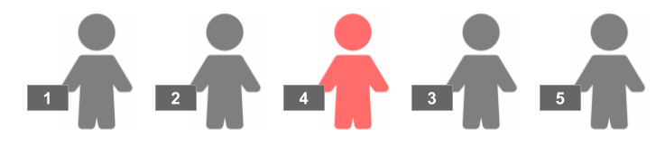

Para entrar en un sitio hay que coger un ticket con un número y esperar
en la cola. Hay gente que se cansa de esperar y abandona la cola. Y hay
otros que tratan de colarse…

Cuando a uno le toca entrar y tiene un número mayor del que tocaría,
**la única forma de saber si realmente se ha colado es ver si de los que
van por detrás de él en la cola hay alguien que tiene un número más
bajo**.

Se desea hacer un programa que diga, por cada persona que hay en la
cola, por delante de cuántas personas se han colado.

**Input Format**

El primer numero  indica la cantidad de gente que hay en la cola.

A continuación vienen los  números de ticket de cada persona.

**Constraints**

\-

**Output Format**

Se imprimirá (en orden de aparición en la cola) el número de ticket de
las personas que se hayan colado, y por delante de cuántas personas se
ha colado. Con el siguiente formato:

    La persona con el ticket T se ha colado por delante de X personas.

Si no se ha colado nadie se escribirá .

**Sample Input 0**

    5
    1 4 3 2 5

**Sample Output 0**

    La persona con el ticket 4 se ha colado por delante de 2 personas.
    La persona con el ticket 3 se ha colado por delante de 1 personas.

**Sample Input 1**

    10
    1 2 5 6 3 4 10 14 13 12

**Sample Output 1**

    La persona con el ticket 5 se ha colado por delante de 2 personas.
    La persona con el ticket 6 se ha colado por delante de 2 personas.
    La persona con el ticket 14 se ha colado por delante de 2 personas.
    La persona con el ticket 13 se ha colado por delante de 1 personas.

**Sample Input 2**

    6
    23 2 7 5 24 25

**Sample Output 2**

    La persona con el ticket 23 se ha colado por delante de 3 personas.
    La persona con el ticket 7 se ha colado por delante de 1 personas.

**Sample Input 3**

    4
    23 25 24 5

**Sample Output 3**

    La persona con el ticket 23 se ha colado por delante de 1 personas.
    La persona con el ticket 25 se ha colado por delante de 2 personas.
    La persona con el ticket 24 se ha colado por delante de 1 personas.

**Sample Input 4**

    5
    7 12 13 17 23

**Sample Output 4**

    COLA EN ORDEN

**Sample Input 5**

    7
    1 5 8 27 33 36 41

**Sample Output 5**

    COLA EN ORDEN
