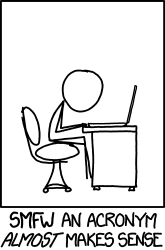

En el món de la informàtica els acrònims són molt comuns:
<https://en.wikipedia.org/wiki/List_of_computing_and_IT_abbreviations>

Transforma una frase en el seu acrònim.



**Input Format**

Una frase en una línia.

**Constraints**

\-

**Output Format**

L'acrònim de la frase

**Sample Input 0**

    Hello world!

**Sample Output 0**

``` 
HW
```

**Sample Input 1**

    is this the real life

**Sample Output 1**

    ITTRL

**Sample Input 2**

    what the font

**Sample Output 2**

    WTF

**Sample Input 3**

    Read the fucking manual

**Sample Output 3**

    RTFM

**Sample Input 4**

    GNU's not Unix

**Sample Output 4**

    GNU

**Sample Input 5**

    PHP Hypertext Preprocessor

**Sample Output 5**

    PHP

**Sample Input 6**

    What you see is what you get

**Sample Output 6**

    WYSIWYG

----------

** Autoria: **
[Gerard Falcó](https://github.com/gerardfp)
