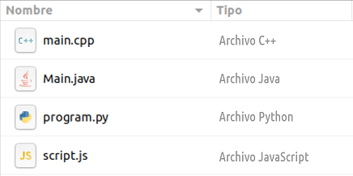

Cada llenguatge de programació té les seves pròpies extensions per als
arxius de codi font.

Els de Java són `.java`, els JavaScript són `.js`, en Python és `py`, en
C++ és `.cpp` ...

Donada una llista d'arxius amb el nom i tipus, imprimeix la llista en
l'ordre invers, i les columnes intercanviades (primer tipus i després
nom).

**Input Format**

L'entrada consta de **quatre** línies.

En cada línia hi ha una paraula que es el  de l'arxiu (amb l'extensió
inclosa), y la resta de la línia és el  d'arxiu.

**Constraints**

\-

**Output Format**

S'imprimirà cada arxiu en una línia, primer el  i després el 

**Sample Input 0**

    main.cpp Archivo C++
    Main.java Archivo Java
    program.py Archivo Python
    script.js Archivo JavaScript

**Sample Output 0**

    Archivo JavaScript script.js 
    Archivo Python program.py 
    Archivo Java Main.java 
    Archivo C++ main.cpp 

**Sample Input 1**

    index.php Archivo PHP
    sample.cs Archivo C#
    app.swift Archivo Swift
    MainActivity.kt Archivo Kotlin

**Sample Output 1**

    Archivo Kotlin MainActivity.kt
    Archivo Swift app.swift
    Archivo C# sample.cs
    Archivo PHP index.php

**Sample Input 2**

    index.ts Archivo TypeScript
    out.asm Archivo assembler
    query.sql Archivo Structured Query Language
    main.rs Archivo Rust

**Sample Output 2**

    Archivo Rust main.rs
    Archivo Structured Query Language query.sql
    Archivo assembler out.asm
    Archivo TypeScript index.ts
