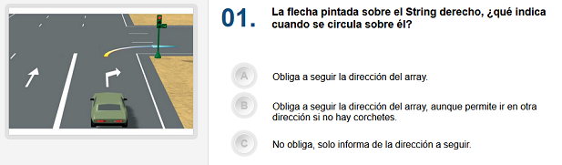

En el examen del carnet de conducir hay 30 preguntas, con tres posibles
respuestas (a, b, c). Se aprueba si se fallan como máximo 3 respuestas.

Deseamos hacer una programa para auto-corregir un test de examen. Por el
momento nos centrarmos solo en las respuestas, y no en las preguntas.

El usuario introducirá las respuestas a cada pregunta, y al finalizar se
le mostrará el resultado, indicándole las respuestas correctas a las
preguntas que haya fallado.

Las respuestas correctas a las preguntas del test son estas:

    "a", "b", "a", "c", "a", "b", "b", "c", "b", "c", "a", "c", "b", "a", "a", "a", "c", "c", "b", "a", "c", "b", "c", "c", "a", "a", "c", "a", "a", "c"

**Input Format**

La entrada consiste en las respuestas del usuario: 30 letras (`a`, `b`,
`c`) separadas por espacios

**Constraints**

\-

**Output Format**

1.  En la primera línea se imprimirá `TEST SUPENDIDO` o `TEST APROBADO`
2.  En la segunda línea se imprimirá `X fallos`
3.  En la tercera línea se imprimirán los números de pregunta separados
    por espacios en blanco. Si el número de pregunta solo ocupa un
    dígito, se precederá con un espacio.
4.  En la cuarta línia se imprimirán las respuestas dadas por el
    usuario. Cada respuesta irá precedida y sucedida por un espacio en
    blanco.
5.  En la quinta línia se alinearán las respuestas correctas a aquellas
    preguntas que se hayan fallado.

**Sample Input 0**

    a b c c a a b c b c a c b a a a c c b a c b c c a a c a a c

**Sample Output 0**

``` 
TEST APROBADO
2 fallos.
 1  2  3  4  5  6  7  8  9 10 11 12 13 14 15 16 17 18 19 20 21 22 23 24 25 26 27 28 29 30 
 a  b  c  c  a  a  b  c  b  c  a  c  b  a  a  a  c  c  b  a  c  b  c  c  a  a  c  a  a  c 
       a        b                                                                         
```

**Sample Input 1**

    a b a c a b b c b c a c b a a a c c b a c b c c a a c a a c 

**Sample Output 1**

``` 
TEST APROBADO
0 fallos.
 1  2  3  4  5  6  7  8  9 10 11 12 13 14 15 16 17 18 19 20 21 22 23 24 25 26 27 28 29 30 
 a  b  a  c  a  b  b  c  b  c  a  c  b  a  a  a  c  c  b  a  c  b  c  c  a  a  c  a  a  c 
                                                                                          
```

**Sample Input 2**

    a b b c a c a c b a a c b a a a b a b a c a c c a a c c a c 

**Sample Output 2**

``` 
TEST SUSPENDIDO
8 fallos.
 1  2  3  4  5  6  7  8  9 10 11 12 13 14 15 16 17 18 19 20 21 22 23 24 25 26 27 28 29 30 
 a  b  b  c  a  c  a  c  b  a  a  c  b  a  a  a  b  a  b  a  c  a  c  c  a  a  c  c  a  c 
       a        b  b        c                    c  c           b                 a      
```
