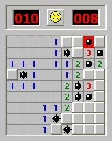

Donat un tauler de buscamines i certes posicions, dir si en aquestes
posicions hi ha o no una mina.



**Input Format**

L'entrada consta en primer lloc de dos números  i  que indiquen el
tamany del tauler ( = files,  = columnes).

A continuació venen les  caselles del tauler (0, 1).

Seguidament venen les posicions en lrs que s'ha de comprovar si hi ha
mina. Cada posició consta de dos números que indiquen la fila  i la
columna  que s'ha de comprovar. **Les posicions comencen per 1** (ja que
és la forma en què es jugaria el joc).

Les posicions a comprovar acaben amb 0 0.

**Constraints**

\-

**Output Format**

Per cada posició a comprovar s'escriurà  si en la casella hi ha una mina
i  si no hi ha.

**Sample Input 0**

    3 3
    
    1 0 0
    0 0 0
    0 0 1
    
    1 1
    2 2
    3 3
    0 0

**Sample Output 0**

    SI
    NO
    SI

**Sample Input 1**

    5 5
    
    0 1 0 0 0
    0 0 0 0 1
    0 1 0 0 1
    0 0 1 1 0
    0 0 1 1 0
    
    1 1
    1 2
    3 4
    3 5
    5 3
    0 0

**Sample Output 1**

    NO
    SI
    NO
    SI
    SI

**Sample Input 2**

    1 1
    
    1
    
    1 1
    0 0

**Sample Output 2**

``` 
SI
```

**Sample Input 3**

    1 4
    
    0 0 0 0
    
    1 1
    1 2
    1 3
    1 4
    0 0

**Sample Output 3**

    NO
    NO
    NO
    NO

**Sample Input 4**

    3 4
    
    0 1 0 0
    0 0 0 1
    0 1 1 0
    
    1 3
    3 4
    3 2
    0 0

**Sample Output 4**

    NO
    NO
    SI
