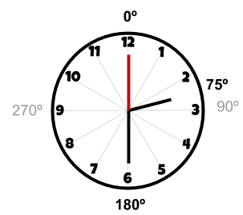
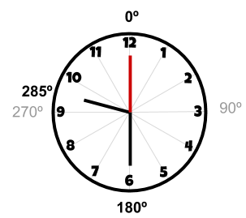

En un rellotge les manilles avancen una mica a cada segon. La manilla
dels segons és la que avança més ràpid (6 graus cada segon). La manilla
dels minuts és una mica més lenta (6 graus cada minut). I la manilla de
les hores és la que avança més lentament (30 graus cada hora).

Però totes tres manilles avancen sempre a cada segon. Així, per exemple
si és la 1:30:00, la manilla de les hores estarà a 45º, la dels minuts a
180º i la dels segons a 360º:

**Input Format**

La entrada consisteix en una hora en format HH:MM:SS

**Constraints**

\-

**Output Format**

S'imprimiran els graus de cada manilla (HH,MM,SS) que corresponen a
l'hora, cadascuna en una línia.

**Sample Input 0**

    2 30 0

**Sample Output 0**

    75.0
    180.0
    0.0

**Explanation 0**

La manilla de les hores està a 75º La manilla dels minuts està a 180º La
manilla dels segons està a 0º

**Sample Input 1**

    9 30 0

**Sample Output 1**

    285.0
    180.0
    0.0

**Explanation 1**

**Sample Input 2**

    0 15 30

**Sample Output 2**

    7.75
    93.0
    180.0

**Explanation 2**

**Sample Input 3**

    11 59 59

**Sample Output 3**

    359.99167
    359.9
    354.0

**Sample Input 4**

    7 43 23

**Sample Output 4**

    231.69167
    260.3
    138.0

**Sample Input 5**

    6 30 30

**Sample Output 5**

    195.25
    183.0
    180.0

----------

** Autoria: **
[Gerard Falcó](https://github.com/gerardfp)
