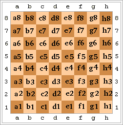

Les caselles del tauler d'escacs es poden identificar per la seva fila i
columna.

Hi han diverses notacions per a identificar la fila i columna d'una
casella.

La més senzilla és la númèrica, on s'identifica cada fila i columna pel
seu número d'ordre.

Una altra notació és l'algebraica, on la fila d'identifica pel seu
número i la columna per les lletres minúscules a, b, c, d, e, f, g, h.



**Input Format**

La entrada consisteix en dos nombres  i  corresponents a la fila i
columna d'una casella.

**Constraints**

\-

**Output Format**

S'imprimirà la posició de la casella en notació algebraica.

**Sample Input 0**

    1 1

**Sample Output 0**

``` 
a1
```

**Sample Input 1**

    2 3

**Sample Output 1**

``` 
b3
```

**Sample Input 2**

    3 1

**Sample Output 2**

``` 
c1
```

**Sample Input 3**

    4 8

**Sample Output 3**

``` 
d8
```

**Sample Input 4**

    5 7

**Sample Output 4**

``` 
e7
```

**Sample Input 5**

    6 6

**Sample Output 5**

``` 
f6
```

**Sample Input 6**

    7 8

**Sample Output 6**

``` 
g8
```

**Sample Input 7**

    8 1

**Sample Output 7**

``` 
h1
```

----------

** Autoria: **
[Gerard Falcó](https://github.com/gerardfp)
