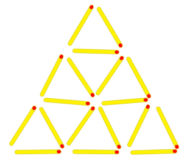
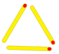
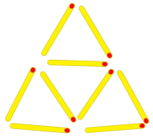
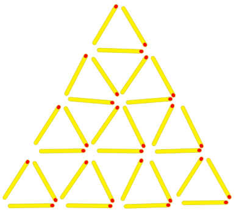

Al meu oncle li agrada fer figures amb els llumins a les sobretaules,
com aquesta piràmide:



Per a fer aquesta piràmide de 3 pisos li calen 18 llumins.

¿Quants llumins calen per fer piràmides de diferents alçades?

*<https://www.aceptaelreto.com/problem/statement.php?id=371>*

**Input Format**

La entrada consta d'un número  indicant l'alçada de la piràmide

**Constraints**

\-

**Output Format**

El nombre de llumins necessaris per fer la piràmide.

**Sample Input 0**

``` 
1
```

**Sample Output 0**

``` 
3
```

**Explanation 0**



**Sample Input 1**

``` 
2
```

**Sample Output 1**

``` 
9
```

**Explanation 1**

9 

**Sample Input 2**

``` 
3
```

**Sample Output 2**

``` 
18
```

**Explanation 2**


**Sample Input 3**

``` 
4
```

**Sample Output 3**

``` 
30
```

**Explanation 3**



**Sample Input 4**

``` 
5
```

**Sample Output 4**

``` 
45
```

**Sample Input 5**

``` 
6
```

**Sample Output 5**

``` 
63
```

**Sample Input 6**

``` 
10
```

**Sample Output 6**

    165

**Sample Input 7**

``` 
50
```

**Sample Output 7**

    3825

**Sample Input 8**

    115

**Sample Output 8**

    20010

**Sample Input 9**

    800

**Sample Output 9**

    961200

**Sample Input 10**

    999

**Sample Output 10**

    1498500
