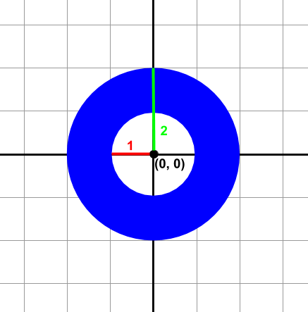
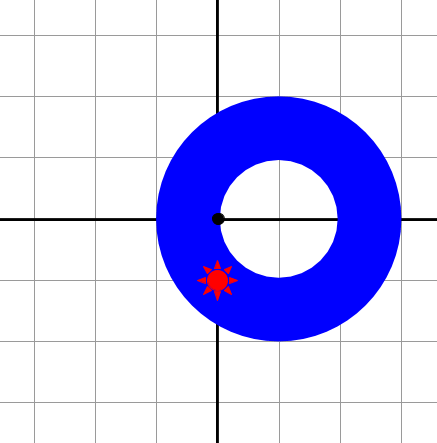
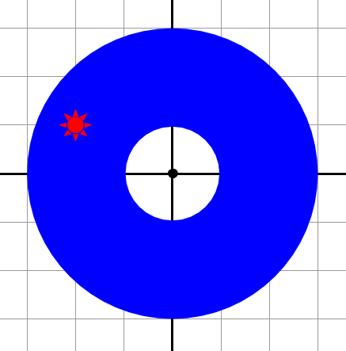
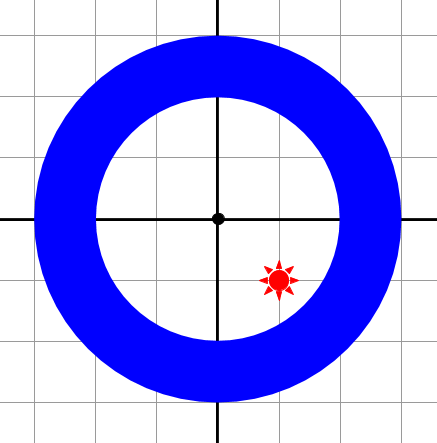
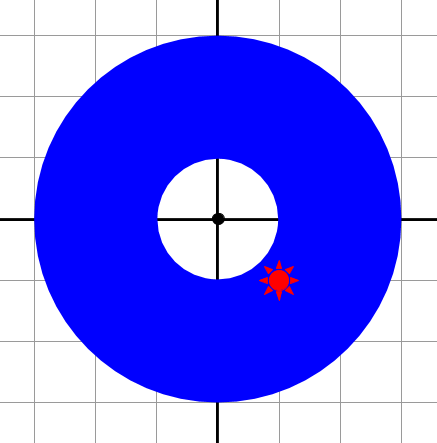

A la fira hi ha una parada que té una anella penjada. Es tracta de tirar
un dard, i si encertes en l'anella tens un premi.

**Input Format**

La entrada consisteix en la definició de l'anella i la posició on s'ha
clavat el dard.

L'anella es defineix per les coordenades del seu centre (, ), i les
longituds dels radis interior () i exterior ().

Per exemple, la següent anella té el centre a (0,0), el radi interior 1,
i l'exterior 2.

La posició del dard es defineix per les seves coordenades (, ).

**Constraints**

\-

**Output Format**

si el dard s'ha clavat a l'anella

en cas contrari

**Sample Input 0**

    0 0 1 2
    0 0

**Sample Output 0**

    false

**Explanation 0**

**Sample Input 1**

    0 0 1 2
    1 1

**Sample Output 1**

    true

**Explanation 1**

**Sample Input 2**

    1 0 1 2
    0 -1

**Sample Output 2**

    true

**Explanation 2**

**Sample Input 3**

    0 0 1 3
    -2 1

**Sample Output 3**

    true

**Explanation 3**

**Sample Input 4**

    0 0 2 3
    1 -1

**Sample Output 4**

    false

**Explanation 4**

**Sample Input 5**

    0 0 1 3
    1 -1

**Sample Output 5**

    true

**Explanation 5**

**Sample Input 6**

    3 3 3 4
    3 -1

**Sample Output 6**

    false

**Sample Input 7**

    3 -1 3 5
    3 3

**Sample Output 7**

    true

**Sample Input 8**

    73 27 25 60
    99 3

**Sample Output 8**

    true

**Sample Input 9**

    73 7 16 25
    87 33

**Sample Output 9**

    false

----------

** Autoria: **
[Gerard Falcó](https://github.com/gerardfp)
