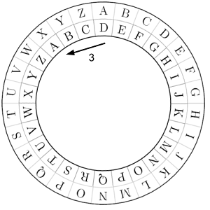
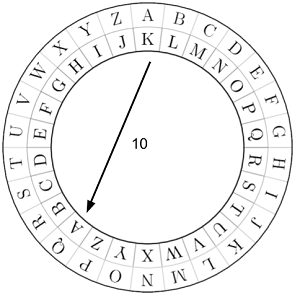
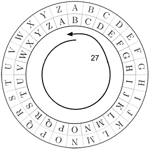

En criptografia, el xifratge Cèsar, és un tipus de xifratge per
substitució en el qual cada lletra del "text clar" es subsititueix per
una altra lletra que estigui un determinat nombre fix de posicions
desplaçades de l'alfabet. El nombre de posicions que s'ha de desplaçar
cada lletra es coneix com a Clau.

**Input Format**

La entrada consta d'una paraula de 4 caracters i una clau  de
desplaçacament.

Tots els caracters són de l'alfabet anglès i en minúscules.

**Constraints**

\-

**Output Format**

S'escriurà la paraula codificada.

**Sample Input 0**

    beca
    3

**Sample Output 0**

    ehfd

**Explanation 0**

**Sample Input 1**

    beca
    5

**Sample Output 1**

    gjhf

**Explanation 1**

**Sample Input 2**

    hola
    10

**Sample Output 2**

    ryvk

**Explanation 2**

**Sample Input 3**

    java
    20

**Sample Output 3**

    dupu

**Explanation 3**

**Sample Input 4**

    zeta
    27

**Sample Output 4**

    afub

**Explanation 4**

**Sample Input 5**

    char
    78

**Sample Output 5**

    char

**Explanation 5**

76 = 26\*3 =\> 3 voltes completes

**Sample Input 6**

    long
    112

**Sample Output 6**

    twvo

**Sample Input 7**

    byte
    0

**Sample Output 7**

    byte
