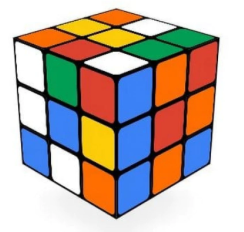

El cub de Rubik stàndard (de tamany 3) consisteix en 26 "cubies" o
"cubelets" (a la part interior no hi ha cap cubelet).



Hi ha moltes altres variants del cub, amb tamanys i formes diferents.

**Input Format**

La entrada consisteix en un nombre  indicant el tamany del cub.

**Constraints**

\-

**Output Format**

S'imprimira el nombre de "cubelets" que té el cub.

**Sample Input 0**

``` 
3
```

**Sample Output 0**

``` 
26
```

**Sample Input 1**

``` 
4
```

**Sample Output 1**

``` 
56
```

**Sample Input 2**

``` 
5
```

**Sample Output 2**

``` 
98
```

**Sample Input 3**

``` 
6
```

**Sample Output 3**

    152

**Sample Input 4**

``` 
10
```

**Sample Output 4**

    488

**Sample Input 5**

    1000

**Sample Output 5**

    5988008

**Sample Input 6**

    1000000

**Sample Output 6**

    5999988000008
