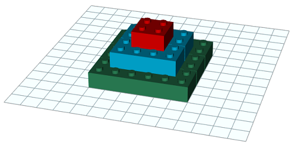
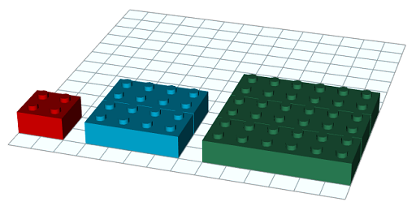
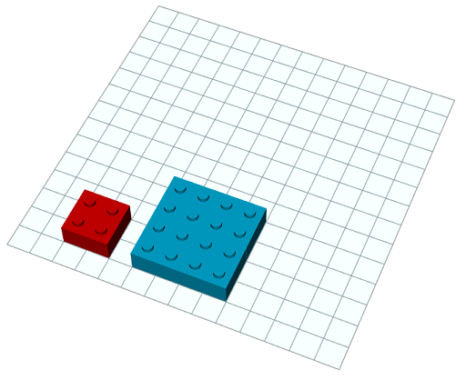
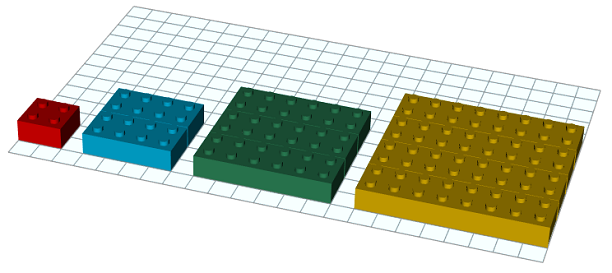

Amb peces de lego de 4x4 pots construir piràmides com aquesta de 3
pisos:



Per a construir-la hem utilitzat 14 peces:



¿Quantes peces es necessiten per a construir un piràmide d'un determinat
nombre de pisos?

**Input Format**

La entrada consta d'un nombre de pisos 

**Constraints**

\-

**Output Format**

El nombre de peces necessàries

**Sample Input 0**

``` 
2
```

**Sample Output 0**

``` 
5
```

**Explanation 0**



**Sample Input 1**

``` 
3
```

**Sample Output 1**

``` 
14
```

**Sample Input 2**

``` 
4
```

**Sample Output 2**

``` 
30
```

**Explanation 2**



**Sample Input 3**

``` 
5
```

**Sample Output 3**

``` 
55
```

**Sample Input 4**

``` 
6
```

**Sample Output 4**

``` 
91
```

**Sample Input 5**

``` 
10
```

**Sample Output 5**

    385

**Sample Input 6**

    1000

**Sample Output 6**

    333833500

**Sample Input 7**

    765892

**Sample Output 7**

    149755297914942910

**Sample Input 8**

    1000000

**Sample Output 8**

    333333833333500000

----------

** Autoria: **
[Gerard Falcó](https://github.com/gerardfp)
