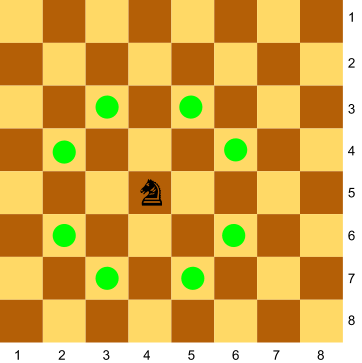
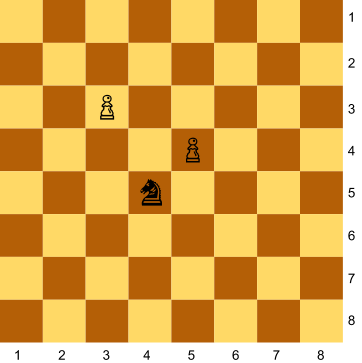
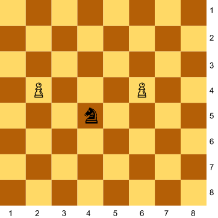
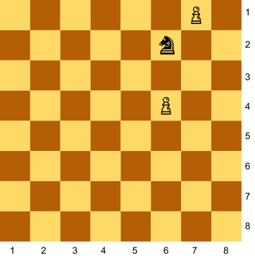
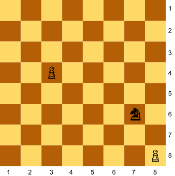

Als escacs el cavall pot saltar fent una "L", així:



Donada la posició d'un cavall i de dos peons al tauler, digues quants
peons està amenaçant el cavall.

**Input Format**

La posició del cavall, i del dos peons

**Constraints**

\-

**Output Format**

0 | 1 | 2

**Sample Input 0**

    4 5
    3 3
    5 4

**Sample Output 0**

``` 
1
```

**Explanation 0**



**Sample Input 1**

    4 5
    2 4
    6 4

**Sample Output 1**

``` 
2
```

**Explanation 1**



**Sample Input 2**

    6 2
    6 4
    7 1

**Sample Output 2**

``` 
0
```

**Explanation 2**



**Sample Input 3**

    1 1
    2 3
    3 2

**Sample Output 3**

``` 
2
```

**Explanation 3**


**Sample Input 4**

    7 6
    3 4
    8 8

**Sample Output 4**

``` 
1
```

**Explanation 4**



**Sample Input 5**

    3 5
    2 2
    1 1

**Sample Output 5**

``` 
0
```

**Sample Input 6**

    8 2
    7 4
    5 3

**Sample Output 6**

``` 
1
```
