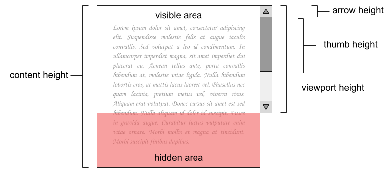

Quan el *content height* és major que el *viewport height*, el navegador
web mostra una *scrollbar* amb dues *arrows* i un *thumb* per a poder
desplaçar el contingut.

Per cada píxel que es desplaça el *thumb*, el contingut es desplaça
proporcionalment en direcció oposada.

Per a implementar una *scrollbar* és necessari calcular el *thumb
height* (de forma que el segment de desplaçament i el *thumb* mantenguin
la proporció amb el *viewport* i el contingut) i el desplaçament del
contingut per cada píxel que es desplaça el *thumb* (*scroll jump*).

**Input Format**

La entrada consisteix en tres nombres:

  - viewport height

  - content height

  - arrow height

**Constraints**

\-

**Output Format**

S'imprimirà el *thumb height* i el *scroll jump*, arrodonits sense
decimals.

**Sample Input 0**

    100 200 25

**Sample Output 0**

    25
    4

**Sample Input 1**

    100 250 25

**Sample Output 1**

    20
    5

**Sample Input 2**

    100 300 20

**Sample Output 2**

    20
    5

**Sample Input 3**

    100 320 10

**Sample Output 3**

    25
    4
