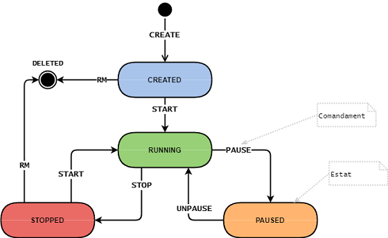

Els contenidors són entorns d'execució aïllats que només tenen accés als
recursos (cpu, memòria, sistema d'arxius, xarxa, etc.) que li són
assignats.

Existeixen moltes solucions de software que permeten el maneig de
contenidors (crear, iniciar, parar, eliminar...).

Una forma habitual de gestionar els contenidors és a través de
comandaments. Per exemple, el comandament START inicia un contenidor, i
STOP l'atura. És clar, que un contenidor ha d'estar un estat adequat per
a poder enviar-li un comandament. Per exemple, no es pot aturar un
contenidor que no estigui en execució.

El següent diagrama ilustra els estats en els que pot estar un
contenidor, i els comandaments que es poden executar sobre ell, canviant
el seu estat.

Es requereix crear un programa per a gestionar els estats d'un
contenidor a través de comandaments.

**Input Format**

La entrada consisteix en un estat i un comandament.

Un contenidor que encara no existeix s'indica amb l'estat '\_'

**Constraints**

estat = { \_ | CREATED | RUNNING | PAUSED | STOPPED }

comandament = { CREATE | START | PAUSE | UNPAUSE | STOP | RM }

**Output Format**

S'indicarà l'estat en que ha de quedar el contenidor si el comandament
es pot realitzar. Si no es pot realitzar, s'indicarà amb el missatge
d'error "Invalid command  for state "

**Sample Input 0**

    _  CREATE

**Sample Output 0**

    CREATED

**Sample Input 1**

    _  START

**Sample Output 1**

    Invalid command START for state _

**Sample Input 2**

    _  PAUSE

**Sample Output 2**

    Invalid command PAUSE for state _

**Sample Input 3**

    _  UNPAUSE

**Sample Output 3**

    Invalid command UNPAUSE for state _

**Sample Input 4**

    _  STOP

**Sample Output 4**

    Invalid command STOP for state _

**Sample Input 5**

    _  RM

**Sample Output 5**

    Invalid command RM for state _

**Sample Input 6**

    CREATED  CREATE

**Sample Output 6**

    Invalid command CREATE for state CREATED

**Sample Input 7**

    CREATED  START

**Sample Output 7**

    RUNNING

**Sample Input 8**

    CREATED  PAUSE

**Sample Output 8**

    Invalid command PAUSE for state CREATED

**Sample Input 9**

    CREATED  UNPAUSE

**Sample Output 9**

    Invalid command UNPAUSE for state CREATED

**Sample Input 10**

    CREATED  STOP

**Sample Output 10**

    Invalid command STOP for state CREATED

**Sample Input 11**

    CREATED  RM

**Sample Output 11**

    DELETED

**Sample Input 12**

    RUNNING  CREATE

**Sample Output 12**

    Invalid command CREATE for state RUNNING

**Sample Input 13**

    RUNNING  START

**Sample Output 13**

    Invalid command START for state RUNNING

**Sample Input 14**

    RUNNING  PAUSE

**Sample Output 14**

    PAUSED

**Sample Input 15**

    RUNNING  UNPAUSE

**Sample Output 15**

    Invalid command UNPAUSE for state RUNNING

**Sample Input 16**

    RUNNING  STOP

**Sample Output 16**

    STOPPED

**Sample Input 17**

    RUNNING  RM

**Sample Output 17**

    Invalid command RM for state RUNNING

**Sample Input 18**

    PAUSED  CREATE

**Sample Output 18**

    Invalid command CREATE for state PAUSED

**Sample Input 19**

    PAUSED  START

**Sample Output 19**

    Invalid command START for state PAUSED

**Sample Input 20**

    PAUSED  PAUSE

**Sample Output 20**

    Invalid command PAUSE for state PAUSED

**Sample Input 21**

    PAUSED  UNPAUSE

**Sample Output 21**

    RUNNING

**Sample Input 22**

    PAUSED  STOP

**Sample Output 22**

    Invalid command STOP for state PAUSED

**Sample Input 23**

    PAUSED  RM

**Sample Output 23**

    Invalid command RM for state PAUSED

**Sample Input 24**

    STOPPED  CREATE

**Sample Output 24**

    Invalid command CREATE for state STOPPED

**Sample Input 25**

    STOPPED  START

**Sample Output 25**

    RUNNING

**Sample Input 26**

    STOPPED  PAUSE

**Sample Output 26**

    Invalid command PAUSE for state STOPPED

**Sample Input 27**

    STOPPED  UNPAUSE

**Sample Output 27**

    Invalid command UNPAUSE for state STOPPED

**Sample Input 28**

    STOPPED  STOP

**Sample Output 28**

    Invalid command STOP for state STOPPED

**Sample Input 29**

    STOPPED  RM

**Sample Output 29**

    DELETED

----------

** Autoria: **
[Gerard Falcó](https://github.com/gerardfp)
