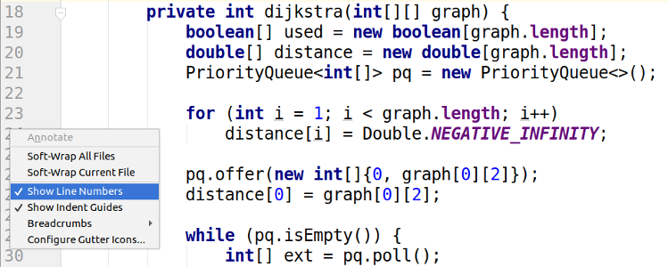

Necessitem incorporar la funció "Show line numbers" al nostre editor de
codi...

**Input Format**

L'entrada és un codi font en vàries línies.

El codi font acaba amb la paraula 

**Constraints**

\-

**Output Format**

S'imprimirà el mateix codi font, però amb el número de línia a l'inici
de cada línia; amb aquest format:

El número de línia ocuparà dos caràcters, després hi haurà un espai en
blanc, després una barra vertical i després un altre espai.

**Sample Input 0**

    if(b[0] >= a[1] || b[1] <= a[0]) return false;
    return true;
    END

**Sample Output 0**

``` 
 1 | if(b[0] >= a[1] || b[1] <= a[0]) return false;
 2 | return true;
```

**Sample Input 1**

    private static int recursiu(int fi, int[][] jobs) {
        int max = 0;
        for (int i = 0; i < jobs.length; i++)
            if(jobs[i][0] >= fi)
                max = Math.max(max, recursiu(jobs[i][1], jobs) + jobs[i][2]);
        return max;
    }
    END

**Sample Output 1**

``` 
 1 | private static int recursiu(int fi, int[][] jobs) {
 2 |     int max = 0;
 3 |     for (int i = 0; i < jobs.length; i++)
 4 |         if(jobs[i][0] >= fi)
 5 |             max = Math.max(max, recursiu(jobs[i][1], jobs) + jobs[i][2]);
 6 |     return max;
 7 | }
```

**Sample Input 2**

    static double floydWarshall(double graph[][]) {
        double dist[][] = new double[graph.length][graph.length];
        int i, j, k;
    
        for (i = 0; i < graph.length; i++)
            for (j = 0; j < graph.length; j++)
                dist[i][j] = graph[i][j];
    
        for (k = 0; k < graph.length; k++)
            for (i = 0; i < graph.length; i++)
                for (j = 0; j < graph.length; j++)
                    if (i != k && j != k && i != j)
                        if (dist[i][k] * dist[k][j] > dist[i][j])
                            dist[i][j] = dist[i][k] * dist[k][j];
    
        return dist[0][graph.length-1];
    }
    END

**Sample Output 2**

``` 
 1 | static double floydWarshall(double graph[][]) {
 2 |     double dist[][] = new double[graph.length][graph.length];
 3 |     int i, j, k;
 4 | 
 5 |     for (i = 0; i < graph.length; i++)
 6 |         for (j = 0; j < graph.length; j++)
 7 |             dist[i][j] = graph[i][j];
 8 | 
 9 |     for (k = 0; k < graph.length; k++)
10 |         for (i = 0; i < graph.length; i++)
11 |             for (j = 0; j < graph.length; j++)
12 |                 if (i != k && j != k && i != j)
13 |                     if (dist[i][k] * dist[k][j] > dist[i][j])
14 |                         dist[i][j] = dist[i][k] * dist[k][j];
15 | 
16 |     return dist[0][graph.length-1];
17 | }
```

**Sample Input 3**

    public class CakeCutting {
    
        static char[][] tarta;
    
        public static void main(String[] args) throws FileNotFoundException {
            Scanner sc = new Scanner(System.in);
    
            while (sc.hasNextInt()) {
                int rows = sc.nextInt();
                int cols = sc.nextInt();
                sc.nextLine();
    
                tarta = new char[rows][cols];
                for (int i = 0; i < rows; i++)
                    tarta[i] = sc.nextLine().toCharArray();
    
                System.out.println(minCortes(0, rows, 0, cols));
            }
        }
    
        static boolean areEqual(int i0, int i1, int j0, int j1) {
    
            for (int i = i0; i < i1; i++)
                for (int j = j0; j < j1; j++)
                    if (tarta[i][j] != tarta[i0][j0])
                        return false;
    
            return true;
        }
    
    
        static int minCortes(int i0, int i1, int j0, int j1){
            int[][][][] K = new int[i1+1][i1+1][j1+1][j1+1];
            for (int m = 1; m <= i1; m++) {
                for (int i = 0; i < i1 - m + 1; i++) {
                    for (int k = 1; k <= j1; k++) {
                        for (int j = 0; j < j1 - k + 1; j++) {
                            System.out.println(i + " " + (i+m) + " " +j + " " + (j+k));
                            if(areEqual(i,i+m,j,j+k)){
                                K[i][i+m][j][j+k] = 0;
                            } else {
                                int min = Integer.MAX_VALUE;
                                for (int ii = 1; ii < m; ii++) {
                                    if (K[i][i+ii][j][j+k] + K[i+ii][i+m][j][j+k] < min) {
                                        min = K[i][i+ii][j][j+k] + K[i+ii][i+m][j][j+k];
                                    }
                                }
                                for (int jj = 1; jj < k; jj++) {
                                    if (K[i][i+m][j][j+jj] + K[i][i+m][j+jj][j+k] < min) {
                                        min = K[i][i+m][j][j+jj] + K[i][i+m][j+jj][j+k];
                                    }
                                }
                                K[i][i+m][j][j+k] = min + 1;
                            }
                        }
                    }
                }
            }
            return K[0][i1][0][j1];
        }
    }
    END

**Sample Output 3**

``` 
 1 | public class CakeCutting {
 2 | 
 3 |     static char[][] tarta;
 4 | 
 5 |     public static void main(String[] args) throws FileNotFoundException {
 6 |         Scanner sc = new Scanner(System.in);
 7 | 
 8 |         while (sc.hasNextInt()) {
 9 |             int rows = sc.nextInt();
10 |             int cols = sc.nextInt();
11 |             sc.nextLine();
12 | 
13 |             tarta = new char[rows][cols];
14 |             for (int i = 0; i < rows; i++)
15 |                 tarta[i] = sc.nextLine().toCharArray();
16 | 
17 |             System.out.println(minCortes(0, rows, 0, cols));
18 |         }
19 |     }
20 | 
21 |     static boolean areEqual(int i0, int i1, int j0, int j1) {
22 | 
23 |         for (int i = i0; i < i1; i++)
24 |             for (int j = j0; j < j1; j++)
25 |                 if (tarta[i][j] != tarta[i0][j0])
26 |                     return false;
27 | 
28 |         return true;
29 |     }
30 | 
31 | 
32 |     static int minCortes(int i0, int i1, int j0, int j1){
33 |         int[][][][] K = new int[i1+1][i1+1][j1+1][j1+1];
34 |         for (int m = 1; m <= i1; m++) {
35 |             for (int i = 0; i < i1 - m + 1; i++) {
36 |                 for (int k = 1; k <= j1; k++) {
37 |                     for (int j = 0; j < j1 - k + 1; j++) {
38 |                         System.out.println(i + " " + (i+m) + " " +j + " " + (j+k));
39 |                         if(areEqual(i,i+m,j,j+k)){
40 |                             K[i][i+m][j][j+k] = 0;
41 |                         } else {
42 |                             int min = Integer.MAX_VALUE;
43 |                             for (int ii = 1; ii < m; ii++) {
44 |                                 if (K[i][i+ii][j][j+k] + K[i+ii][i+m][j][j+k] < min) {
45 |                                     min = K[i][i+ii][j][j+k] + K[i+ii][i+m][j][j+k];
46 |                                 }
47 |                             }
48 |                             for (int jj = 1; jj < k; jj++) {
49 |                                 if (K[i][i+m][j][j+jj] + K[i][i+m][j+jj][j+k] < min) {
50 |                                     min = K[i][i+m][j][j+jj] + K[i][i+m][j+jj][j+k];
51 |                                 }
52 |                             }
53 |                             K[i][i+m][j][j+k] = min + 1;
54 |                         }
55 |                     }
56 |                 }
57 |             }
58 |         }
59 |         return K[0][i1][0][j1];
60 |     }
61 | }
```

----------

** Autoria: **
[Gerard Falcó](https://github.com/gerardfp)
