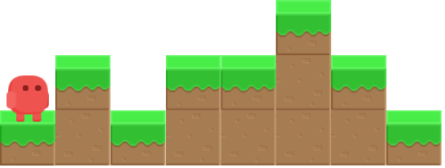
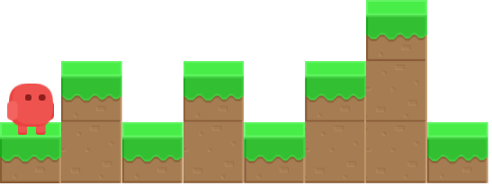
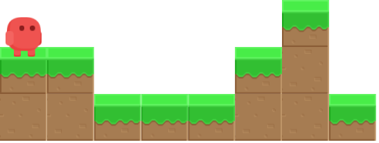

En un joc de plataformes, el personatge ha d'anar fent salts per a poder
avançar. En la situació següent, per exemple, haurà de fer 3 salts per a
arribar al final:



Podem entendre el mapa del joc com una succesió de nombres que indiquen
l'altura del terreny. En el cas anterior es podria definir com:

    1 2 1 2 2 3 2 1

En cada salt, el personatge pot avançar només 1 casella.

**Input Format**

La entrada consta d'una successió de N nombres que indiquen l'altura H
del terreny . La successió acaba amb un -1 (que no s'ha tenir en
compte).

**Constraints**

\-

**Output Format**

S'imprimirà el nombre mínim de salts que necessita donar per a arribar
al final.

**Sample Input 0**

    1 2 1 2 1 2 3 1   -1

**Sample Output 0**

``` 
4
```

**Explanation 0**



**Sample Input 1**

    2 2 1 1 1 2 3 1   -1

**Sample Output 1**

``` 
2
```

**Explanation 1**



**Sample Input 2**

    3 3 2 2 1   -1

**Sample Output 2**

``` 
0
```

**Explanation 2**


**Sample Input 3**

    1 2 3 4   -1

**Sample Output 3**

``` 
3
```

**Explanation 3**


**Sample Input 4**

    1   -1

**Sample Output 4**

``` 
0
```

**Explanation 4**


**Sample Input 5**

    1 2 3 4 1 2 3 4 5 6 7 8 1   -1

**Sample Output 5**

``` 
10
```

**Sample Input 6**

    9 5 1 2 3 1 2  -1

**Sample Output 6**

``` 
3
```
