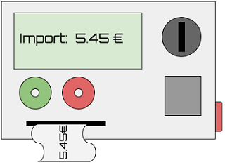
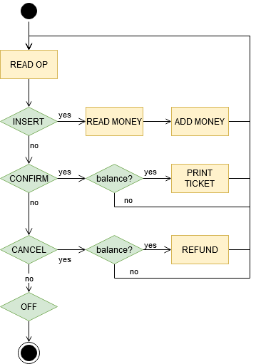

Es demana implementar una màquina expenedora de tíquets.

Els usuaris de la màquina insereixen diners, i reben un tíquet per valor
dels diners inserits. També poden cancel·lar l'operació i recuperar els
diners inserits.

La màquina poseeix un *display* que informa del balanç de diners que
l'usuari ha inserit. Està en funcionament ininterrompudament fins es
pitja un botó d'apagat.

El següent diagrama de flux mostra el funcionament de la màquina:

**Input Format**

La entrada consisteix en una seqüència d'operacions. L'última operació
sempre és la d'apagar la màquina.

operacions = `{ INSERT | CONFIRM | CANCEL }`

L'operació `INSERT` antecedeix a la  de diners inserits.

**Constraints**

\-

**Output Format**

S'anirà mostrant el resultat de les operacions:

  - ADD MONEY: `Balance: $BALANCE`
  - PRINT TICKET: `Ticket: $BALANCE`
  - REFUND: `Refund: $BALANCE`

**Sample Input 0**

    INSERT 10
    INSERT 10
    CONFIRM
    OFF

**Sample Output 0**

    Balance: 10
    Balance: 20
    Ticket: 20

**Sample Input 1**

    INSERT 10
    INSERT 10
    CONFIRM
    INSERT 10
    CONFIRM
    OFF

**Sample Output 1**

    Balance: 10
    Balance: 20
    Ticket: 20
    Balance: 10
    Ticket: 10

**Sample Input 2**

    INSERT 10
    INSERT 10
    CANCEL
    INSERT 10
    CONFIRM
    OFF

**Sample Output 2**

    Balance: 10
    Balance: 20
    Refund: 20
    Balance: 10
    Ticket: 10

**Sample Input 3**

    INSERT 10
    INSERT 10
    CANCEL
    CONFIRM
    INSERT 10
    CONFIRM
    CONFIRM
    OFF

**Sample Output 3**

    Balance: 10
    Balance: 20
    Refund: 20
    Balance: 10
    Ticket: 10

**Sample Input 4**

    CONFIRM
    CONFIRM
    CANCEL
    CANCEL
    CONFIRM
    INSERT 10
    CONFIRM
    CONFIRM
    OFF

**Sample Output 4**

    Balance: 10
    Ticket: 10

**Sample Input 5**

    CONFIRM
    CANCEL
    INSERT 10
    CONFIRM
    INSERT 10
    INSERT 10
    CONFIRM
    CANCEL
    INSERT 10
    OFF

**Sample Output 5**

    Balance: 10
    Ticket: 10
    Balance: 10
    Balance: 20
    Ticket: 20
    Balance: 10
