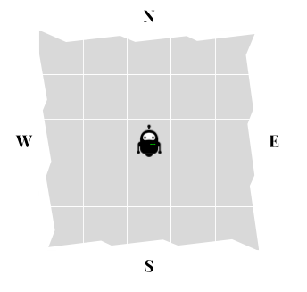
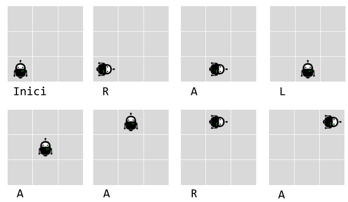
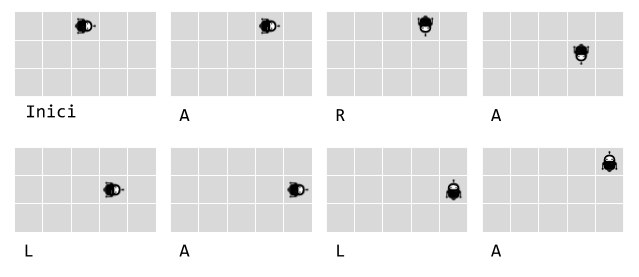

La instal·lació de proves d'una fàbrica de robots necessita un programa
per verificar els moviments del robot.

Els robots tenen tres possibles moviments:

  - gir a la dreta (R)
  - gir a l'esquerra (L)
  - avançar (A)

Els robots es col loquen en una xarxa hipotètica infinita, orientats cap
a una direcció particular (, , , ) en unes coordenades {, }.

Aleshores el robot rep diverses instruccions, moment en què la
instal·lació de proves verifica la nova posició del robot i en quina
direcció apunta.

Per exemple, la cadena de lletres  significa:

  - Avançar (A)
  - Gir a la dreta (R)
  - Avançar (A)
  - Gir a l'esquerra x3 (LLL)
  - Avançar (A)

Digueu que un robot comença a {0, 0} mirant al nord. A continuació,
executar aquest flux d'instruccions hauria de deixar-lo a {1, 0} mirant
al sud.

**Input Format**

La entrada consisteix en:

Dos nombres {, } indicant les coordenades de la posició inicial.

Un caràcter  indicant la orientació inicial.

Una cadena de  caràcters amb les instruccions

**Constraints**

\-100 \<= X \<= 100

\-100 \<= Y \<= 100

O = { |  |  | }

1 \<= L \<= 100

**Output Format**

S'imprimiran les coordenades finals {, } i la orientació en que queda el
robot

**Sample Input 0**

    0 0
    N
    AARARAL

**Sample Output 0**

    {1, 1}
    E

**Explanation 0**

**Sample Input 1**

    0 0
    N
    RALAARA

**Sample Output 1**

    {2, 2}
    E

**Explanation 1**

**Sample Input 2**

    2 2
    E
    ARALALA

**Sample Output 2**

    {4, 2}
    N

**Explanation 2**

**Sample Input 3**

    3 1
    E
    LARLAAR

**Sample Output 3**

    {3, 4}
    E

**Sample Input 4**

    -1 -2
    S
    AAA

**Sample Output 4**

    {-1, -5}
    S

**Sample Input 5**

    17 -3
    E
    AAALAAA

**Sample Output 5**

    {20, 0}
    N

**Sample Input 6**

    20 10
    W
    ALARLARLARRARRR

**Sample Output 6**

    {19, 8}
    W

**Sample Input 7**

    134 -33
    S
    ALARRLAAALRLLAARLAARLLLARRRALARLRLALLLRAALRALRALLRAAALRAALR

**Sample Output 7**

    {141, -36}
    E
