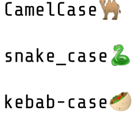

Existeixen nombroses convencions a l'hora d'escollir la seqüència de
caracters que s'usa com a identificador de variables, tipus, funcions,
...

Normalment, a cada llenguatge hi ha unes convencions, encara que cada
organització té el seu propi estil.

Les més comuns són:

  - CamelCase : Java, C\#, Javascript, Go, Ruby, JSON

  - snake\_case : Python, PHP, C, C++

  - kebab-case : Lisp, XML

**Input Format**

Les paraules que componen l'identificador

**Constraints**

No hi ha restriccions sigificatives

**Output Format**

S'escriurà l'identificador en CamelCase, snake\_case i kebab-case.

En CamelCase cada paraula comença en majúscules, i no es separen amb
espais.

En snake\_case les paraules es separen amb \_ i es posen en majúscules
si totes les lletres són majúscules. Si hi ha alguna lletra minúscula,
es posen totes les lletres en minúscula.

En kebab-case totes les lletres van sempre en minúscula, i separades amb
-

**Sample Input 0**

    case styles

**Sample Output 0**

    CaseStyles
    case-styles
    case_styles

**Sample Input 1**

    CASE STYLES

**Sample Output 1**

    CaseStyles
    case-styles
    CASE_STYLES

**Sample Input 2**

    CAsE STYLES

**Sample Output 2**

    CaseStyles
    case-styles
    case_styles

**Sample Input 3**

    Fork join worker thread factory

**Sample Output 3**

    ForkJoinWorkerThreadFactory
    fork-join-worker-thread-factory
    fork_join_worker_thread_factory

**Sample Input 4**

    abstract transactional data source spring context tests

**Sample Output 4**

    AbstractTransactionalDataSourceSpringContextTests
    abstract-transactional-data-source-spring-context-tests
    abstract_transactional_data_source_spring_context_tests

----------

** Autoria: **
[Gerard Falcó](https://github.com/gerardfp)
