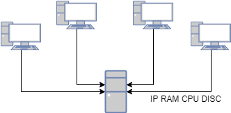

El software d'inventari que tenim a la xarxa obté diversa informació
sobre l'estat dels equips de la xarxa. Hem configurat aquest software
per a que reculli la següent informació de cada màquina:

  - Adreça IP

  - Memòria RAM instal·lada (Gb)

  - Velocitat del processador (MHz)

  - Espai de disc (Gb)

Amb la informació recopilada podem generar l'inventari de màquines de la
xarxa.

Ara el que ens interessa és poder ordenar l'inventari segons els
diversos camps, establint l'ordre en que s'han de comparar aquests
camps.

**Input Format**

La primera línia indica l'ordre dels camps pels quals volem ordenar
l'inventari. Per exemple:

    RAM DISC CPU IP

A continuació ve l'inventari en diverses línies. A cada línia hi trobem
la informació d'un host (IP, RAM, CPU, DISC). Per exemple:

    192.168.1.1 16 4000 500

La entrada acaba amb la línia "**END**"

**Constraints**

No hi ha

**Output Format**

S'imprimirà l'inventari ordenat segons els camps indicats.

**Sample Input 0**

    CPU RAM DISC IP
    192.168.1.1 8 4000 500
    192.168.1.2 16 2000 500
    192.168.1.3 8 2000 200
    192.168.1.4 8 2000 200 
    192.168.1.5 8 2000 400
    __END__

**Sample Output 0**

    192.168.1.1 8 4000 500
    192.168.1.2 16 2000 500
    192.168.1.5 8 2000 400
    192.168.1.3 8 2000 200
    192.168.1.4 8 2000 200

**Explanation 0**

El primer camp d'ordenació és la CPU, per tant el host que ha
d'aparèixer en primer lloc és:

    192.168.1.1 8 4000 500

El valor CPU és igual per a la resta de hosts, per tant hem d'ordenar
pel camp RAM. Així el host que ha d'aparèixer en segon lloc és:

    192.168.1.2 16 2000 500

Per a la resta de hosts el valor RAM és el mateix, així que hem
d'ordenar-los pel camp DISC. El tercer host és:

    192.168.1.5 8 2000 400

Com el dos hosts restant tenen el mateix valor DISC, hem d'ordnar per
IP:

    192.168.1.3 8 2000 200
    192.168.1.4 8 2000 200

**Sample Input 1**

    CPU DISC RAM IP
    192.168.0.1 4 3000 120
    192.168.0.2 4 3000 120
    192.168.0.12 4 3000 120
    192.168.0.22 4 3000 120
    __END__

**Sample Output 1**

    192.168.0.1 4 3000 120
    192.168.0.2 4 3000 120
    192.168.0.12 4 3000 120
    192.168.0.22 4 3000 120

**Explanation 1**

Com els valors de CPU, DISC i RAM són els mateixos, hem d'ordenar per IP

**Sample Input 2**

    IP CPU RAM DISC
    10.1.1.2 8 2000 500
    10.2.1.3 16 3000 1000
    10.1.2.2 4 4000 250
    10.2.2.1 6 3500 400
    10.0.2.2 2 1000 120
    __END__

**Sample Output 2**

    10.0.2.2 2 1000 120
    10.1.1.2 8 2000 500
    10.1.2.2 4 4000 250
    10.2.1.3 16 3000 1000
    10.2.2.1 6 3500 400

**Explanation 2**

El primer camp d'ordenació és la IP. Com totes són diferents, no cal
mirar cap més camp d'ordenació.

**Sample Input 3**

    DISC CPU RAM IP
    192.168.35.64   4 2000 500
    192.168.127.64  4 3000 500
    192.168.127.127 8 2000 500
    192.168.254.100 4 2000 1000
    192.168.80.8    8 3000 1000
    192.168.10.8    4 2000 500
    192.168.1.8     8 2000 500
    192.168.25.100  4 3000 500
    192.168.2.100   4 2000 1000
    __END__

**Sample Output 3**

    192.168.80.8 8 3000 1000
    192.168.2.100 4 2000 1000
    192.168.254.100 4 2000 1000
    192.168.25.100  4 3000 500
    192.168.127.64  4 3000 500
    192.168.1.8     8 2000 500
    192.168.127.127 8 2000 500
    192.168.10.8    4 2000 500
    192.168.35.64   4 2000 500

----------

** Autoria: **
[Gerard Falcó](https://github.com/gerardfp)
