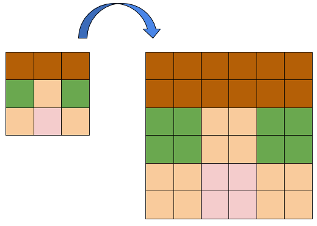

Nearest-neighbour interpolation és un algoritme d'escalat d'imatges.
Quan fem una imatge més gran, l'algoritme Nearest-neighbour genera els
nous pixels a partir dels originals més propers:



Aquest algoritme funciona bé per a imatges 'pixel-art', però no és el
més adequat per a imatges fotogràfiques ja que crea "dents de serra".

**Input Format**

La entrada consisteix en una imatge en ASCII-ART. En primer lloc ve el
tamany en línies  de la imatge, i a continuació la imatge.

Finalment venen el factor d'escalat horitzontal  i el vertical .

**Constraints**

\-

**Output Format**

S'imprimirà la imatge escalada segons els factors horitzontal i
vertical.

**Sample Input 0**

    3
    #..
    .%.
    ..=
    4 4

**Sample Output 0**

    ####........
    ####........
    ####........
    ####........
    ....%%%%....
    ....%%%%....
    ....%%%%....
    ....%%%%....
    ........====
    ........====
    ........====
    ........====

**Sample Input 1**

    3
    #..
    .%.
    ..=
    6 2

**Sample Output 1**

    ######............
    ######............
    ......%%%%%%......
    ......%%%%%%......
    ............======
    ............======

**Sample Input 2**

    3
    #..
    .%.
    ..=
    2 6

**Sample Output 2**

    ##....
    ##....
    ##....
    ##....
    ##....
    ##....
    ..%%..
    ..%%..
    ..%%..
    ..%%..
    ..%%..
    ..%%..
    ....==
    ....==
    ....==
    ....==
    ....==
    ....==

**Sample Input 3**

    5
     ,od8888bn.      ,.od88bo,
    d8P'   `*88bn. ,       `Y8b
    88'      `*888b.        `D8
    Y8b        ,`*Y8bn.    ,d8P
    `*Y8bn,. ;     `*+88888P*'
    1 3

**Sample Output 3**

``` 
 ,od8888bn.      ,.od88bo,
 ,od8888bn.      ,.od88bo,
 ,od8888bn.      ,.od88bo,
d8P'   `*88bn. ,       `Y8b
d8P'   `*88bn. ,       `Y8b
d8P'   `*88bn. ,       `Y8b
88'      `*888b.        `D8
88'      `*888b.        `D8
88'      `*888b.        `D8
Y8b        ,`*Y8bn.    ,d8P
Y8b        ,`*Y8bn.    ,d8P
Y8b        ,`*Y8bn.    ,d8P
`*Y8bn,. ;     `*+88888P*'
`*Y8bn,. ;     `*+88888P*'
`*Y8bn,. ;     `*+88888P*'
```

**Sample Input 4**

    5
     ,od8888bn.      ,.od88bo,
    d8P'   `*88bn. ,       `Y8b
    88'      `*888b.        `D8
    Y8b        ,`*Y8bn.    ,d8P
    `*Y8bn,. ;     `*+88888P*'
    3 2

**Sample Output 4**

```` 
   ,,,oooddd888888888888bbbnnn...                  ,,,...oooddd888888bbbooo,,,
   ,,,oooddd888888888888bbbnnn...                  ,,,...oooddd888888bbbooo,,,
ddd888PPP'''         ```***888888bbbnnn...   ,,,                     ```YYY888bbb
ddd888PPP'''         ```***888888bbbnnn...   ,,,                     ```YYY888bbb
888888'''                  ```***888888888bbb...                        ```DDD888
888888'''                  ```***888888888bbb...                        ```DDD888
YYY888bbb                        ,,,```***YYY888bbbnnn...            ,,,ddd888PPP
YYY888bbb                        ,,,```***YYY888bbbnnn...            ,,,ddd888PPP
````

``` 
```

**Sample Input 5**

    9
    _________________
    `$$$$$$$$$$$$$$$'
     $$'`$'`$'`$'`$$
     $$bd$bd$bd$bd$$
     $$$$*"` `"*$$$$
     $$$`       `$$$
     $$[         ]$$
     $$[         ]$$
    j$$[         ]$$$L
    2 1

**Sample Output 5**

    __________________________________
    ``$$$$$$$$$$$$$$$$$$$$$$$$$$$$$$''
      $$$$''``$$''``$$''``$$''``$$$$
      $$$$bbdd$$bbdd$$bbdd$$bbdd$$$$
      $$$$$$$$**""``  ``""**$$$$$$$$
      $$$$$$``              ``$$$$$$
      $$$$[[                  ]]$$$$
      $$$$[[                  ]]$$$$
    jj$$$$[[                  ]]$$$$$$LL

**Sample Input 6**

    9
    _________________
    `$$$$$$$$$$$$$$$'
     $$'`$'`$'`$'`$$
     $$bd$bd$bd$bd$$
     $$$$*"` `"*$$$$
     $$$`       `$$$
     $$[         ]$$
     $$[         ]$$
    j$$[         ]$$$L
    1 2

**Sample Output 6**

    _________________
    _________________
    `$$$$$$$$$$$$$$$'
    `$$$$$$$$$$$$$$$'
     $$'`$'`$'`$'`$$
     $$'`$'`$'`$'`$$
     $$bd$bd$bd$bd$$
     $$bd$bd$bd$bd$$
     $$$$*"` `"*$$$$
     $$$$*"` `"*$$$$
     $$$`       `$$$
     $$$`       `$$$
     $$[         ]$$
     $$[         ]$$
     $$[         ]$$
     $$[         ]$$
    j$$[         ]$$$L
    j$$[         ]$$$L
