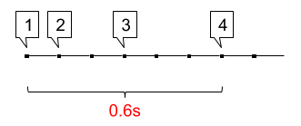
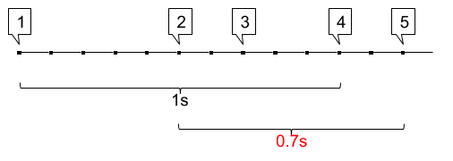

Desitjem implementar una sistema d'alerta d'atacs de denegació de servei
(DDoS). Aquests atacs consisteixen en que l'atacant realitza una gran
quantitat de connexions utilitzant una botnet.

Una forma de prevenir aquests atacs és mitjançant una política que
denegui les connexions si aquestes es produeixen amb massa freqüència
(connexions/temps).

Implementarem al firewall un sistema de detecció d'atacs DDoS, que
alerti quan es produeixen més connexions de les permeses en un període
de temps.

Establirem aquesta política a 4 connexions en 1 segon. Cada cop que es
superi aquesta freqüència es mostrarà una alerta.

**Input Format**

La entrada consisteix en una seqüència de *floats* que indiquen el temps
(T) que ha passat entre una connexió i la següent.

La seqüencia acaba amb -1.

**Constraints**

\-

**Output Format**

S'imprimirà el missatge "DDos alert", cada cop que es superin les 4
connexions en menys d'1 segon.

**Sample Input 0**

    0.1  0.2  0.3      -1

**Sample Output 0**

    DDoS alert

**Explanation 0**

Es produeix la primera connexió

Passen 0.1 segons i es produeix la segona connexió

Passen 0.2 segons i es produeix la tercera connexió

Passen 0.3 segons i es produeix la quarta connexió

S'han produït 4 connexions en 0.6 segons

**Sample Input 1**

    0.5  0.2  0.3      -1

**Explanation 1**

Es produeix la primera connexió

Passen 0.5 segons i es produeix la segona connexió

Passen 0.2 segons i es produeix la tercera connexió

Passen 0.3 segons i es produeix la quarta connexió

S'han produït 4 connexions en 1 segon, és a dir, no s'ha superat el
límit.

**Sample Input 2**

    0.5  0.2  0.3  0.2      -1

**Sample Output 2**

    DDoS alert

**Explanation 2**

Es produeix la primera connexió

Passen 0.5 segons i es produeix la segona connexió

Passen 0.2 segons i es produeix la tercera connexió

Passen 0.3 segons i es produeix la quarta connexió

Passen 0.2 segons i es produeix la cinquena connexió

Entre la segona i la cinquena connexió han passat 0.7 segons, és a dir,
s'ha superat el límit.

**Sample Input 3**

    0.5  0.2  0.3  0.2  0.6  0.1      -1

**Sample Output 3**

    DDoS alert
    DDoS alert

**Explanation 3**

S'han produït dues alertes:

entre la segona i cinquena connexió (0.2+0.3+0.2)

i entre la quarta i la setena (0.2+0.6+0.1).

**Sample Input 4**

    0.5  0.2  0.3  0.2  0.1  0.1      -1

**Sample Output 4**

    DDoS alert
    DDoS alert
    DDoS alert

**Explanation 4**

0.2+0.3+0.2

0.3+0.2+0.1

0.2+0.1+0.1

**Sample Input 5**

    0.5  0.2  0.3  1.2  0.1  0.1  0.1  0.1  0.7  0.4  0.1  0.2  0.6      -1

**Sample Output 5**

    DDoS alert
    DDoS alert
    DDoS alert
    DDoS alert
    DDoS alert

**Sample Input 6**

    0.3  0.3  0.3  0.2  0.2  0.5  0.2  0.1  0.1  0.1  0.1  0.7  0.4  0.1  0.2  0.6  0.9  0.1      -1

**Sample Output 6**

    DDoS alert
    DDoS alert
    DDoS alert
    DDoS alert
    DDoS alert
    DDoS alert
    DDoS alert
    DDoS alert
    DDoS alert
    DDoS alert
    DDoS alert
    DDoS alert

----------

** Autoria: **
[Gerard Falcó](https://github.com/gerardfp)
