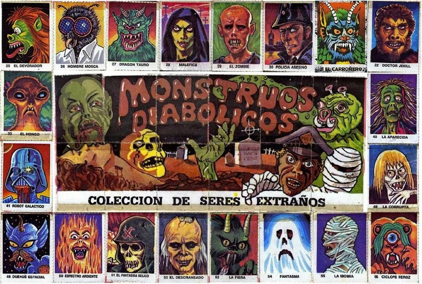

David s'està fent una col·lecció de cromos. S'ha fet una app per a
portar l'inventari de cromos que té. Ara vol que l'app li digui quins
cromos té repetits.

En total hi ha 68 cromos. Estan identificats amb números consecutius de
l'1 al 68.

**Input Format**

Un número  indica la quantitat de cromos.

A continuació venen els identificadors de cada cromo.

**Constraints**

\-

**Output Format**

S'imprimirà l'identificador dels cromos que té repetits, i quantes
vegades el té repetit. Ordenats per identificador i en línies diferents.

El format és:

    id: vegades

**Sample Input 0**

    5
    11 3 9 11 5

**Sample Output 0**

    11: 2

**Explanation 0**

El cromo 11 el té repetit 2 vegades

**Sample Input 1**

    5
    11 33 11 11 33

**Sample Output 1**

    11: 3
    33: 2

**Explanation 1**

El cromo 11 el té repetit 3 vegades El cromo 33 el té repetit 2 vegades

**Sample Input 2**

    5
    1 2 3 4 5

**Explanation 2**

No té cap cromo repetit

**Sample Input 3**

    9
    1 2 3 1 2 3 1 2 3

**Sample Output 3**

    1: 3
    2: 3
    3: 3

**Sample Input 4**

    5
    1 68 1 68 1

**Sample Output 4**

    1: 3
    68: 2

**Sample Input 5**

    100
    9 25 57 61 37 4 26 44 29 61 18 66 33 24 20 20 2 51 4 55 44 32 31 21 7 51 52 68 43 27 60 9 42 23 23 47 26 24 50 52 60 26 5 24 23 55 43 44 35 6 30 22 18 1 51 29 34 36 35 10 56 54 66 1 62 29 60 63 35 1 5 5 13 40 20 21 62 18 35 35 12 38 23 51 59 44 68 8 51 55 60 64 20 34 64 21 13 48 66 57

**Sample Output 5**

    1: 3
    4: 2
    5: 3
    9: 2
    13: 2
    18: 3
    20: 4
    21: 3
    23: 4
    24: 3
    26: 3
    29: 3
    34: 2
    35: 5
    43: 2
    44: 4
    51: 5
    52: 2
    55: 3
    57: 2
    60: 4
    61: 2
    62: 2
    64: 2
    66: 3
    68: 2

----------

** Autoria: **
[Gerard Falcó](https://github.com/gerardfp)
