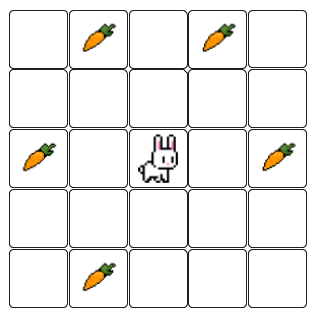
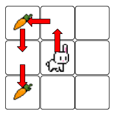
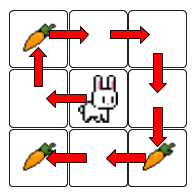

Ajuda al conill a menjar-se la pastanagues\!

El conill es troba inicialment en el centre de la graella, i es pot
moure en les quatre direccions, una casella cada vegada.

Quants moviments necessita per a menjar-se totes les pastanagues **en
l'ordre correcte**?

**Input Format**

En primer lloc ve un nombre imparell  que indica el tamany de la
graella: .

A continuació ve la graella. Les pastanagues estan indicades amb el
número d'ordre en què s'han de menjar.

**Constraints**

\-

**Output Format**

S'escriurà el nombre de moviments que necessita el conill per a
menjar-se totes les pastanagues en l'ordre correcte.

**Sample Input 0**

    3
    1 0 0
    0 0 0
    2 0 0

**Sample Output 0**

``` 
4
```

**Explanation 0**



**Sample Input 1**

    3
    1 0 0
    0 0 0
    3 0 2

**Sample Output 1**

``` 
8
```

**Explanation 1**



**Sample Input 2**

    5
    0 0 3 0 0
    0 1 0 2 0
    0 0 0 0 0
    0 0 0 0 0
    0 0 4 0 0

**Sample Output 2**

``` 
10
```

**Explanation 2**


**Sample Input 3**

    5
    0 0 0 0 0
    0 2 3 4 0
    0 1 0 5 0
    0 8 7 6 0
    0 0 0 0 0

**Sample Output 3**

``` 
8
```

**Sample Input 4**

    5
    0 0 0 0 0
    0 3 2 4 0
    0 1 0 6 0
    0 8 7 5 0
    0 0 0 0 0

**Sample Output 4**

``` 
12
```

**Sample Input 5**

    9
    10  0  5  0  0  0  0  0 12
     0  0  0  0  0  4  0  0  0
     0  0  0  0  0  0  0  0  7
     1  0  0  0  0  0  0  0  0
     0  0  0  0  0  0 11  0  0
     0  0  0  0  0  0  0  0  0
     0  0  0  6  0  0  2  0  0
     0  3  0  0  0  0  0  0  0
     8  0  0  0  0  0  0  0  9

**Sample Output 5**

    104

----------

** Autoria: **
[Gerard Falcó](https://github.com/gerardfp)
