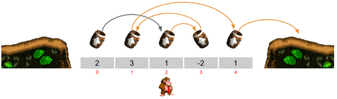
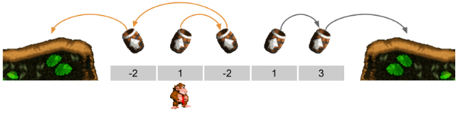
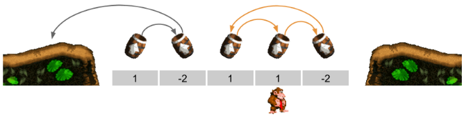

En el juego Donkey Kong hay unos "barriles cañón" que disparan al gorila
cuando cae sobre uno de ellos. Hay veces en los que caes sobre un barril
y éste te dispara y vas a caer a otro barril, que a su vez te dispara
sobre otro barril, y así sucesivamente hasta que vuelves a caer sobre
tierra.

En esta versión, los barriles estan situados uno al lado de otro y cada
barril dispara al gorila hacia arriba a la izquierda o hacia arriba a la
derecha (describiendo una parábola).

Cada barril lo dispara con una fuerza, que se representa con un número.
Este número indica cuántas posiciones proyectará al gorila. Si el número
es positivo hacia la derecha, y si es negativo hacia la izquierda. Se
puede observar en la siguiente imagen:

El problema consiste en: dadas la fuerzas de unos barriles y el barril
donde cae inicialmente el gorila, averiguar si el gorila terminará
saliendo por la IZQUIERDA, por la DERECHA, o si se quedará en un BUCLE
sin poder salir.

**Input Format**

El primer número  indica la cantidad de barriles.

A continuación vienen los  números que indican la fuerza de cada barril.

El último número  indica la posición de Donkey Kong (el primer barril en
el que cae).

**Constraints**

\-

**Output Format**

{ IZQUIERDA | DERECHA | BUCLE }

**Sample Input 0**

    5
    2 3 1 -2 1
    2

**Sample Output 0**

    DERECHA

**Explanation 0**

La posición de DK es 2

El barril en la posición 2 tiene fuerza 1 → la posición de DK pasa a ser
3 (2+1)

El barril en la posición 3 tiene fuerza -2 → la posición de DK pasa a
ser 1 (3-2)

El barril en la posición 1 tiene fuerza 3 → la posición de DK pasa a ser
4 (3+1)

El barril en la posición 4 tiene fuerza 1 → la posición de DK pasa a ser
5 (4+1)

Como 5 es mayor que la posición del último barril, DK ha salido por la
DERECHA.

**Sample Input 1**

    5
    -2 1 -2 1 3
    1

**Sample Output 1**

    IZQUIERDA

**Explanation 1**

La posición de DK es 1

El barril en la posición 1 tiene fuerza 1 → la posición de DK pasa a ser
2 (1+1)

El barril en la posición 2 tiene fuerza -2 → la posición de DK pasa a
ser 0 (2-2)

El barril en la posición 0 tiene fuerza -2 → la posición de DK pasa a
ser -2 (0-2)

Como -2 es menor que la posición del primer barril, DK ha salido por la
IZQUIERDA

**Sample Input 2**

    5
    1 -2 1 1 -2
    3

**Sample Output 2**

    BUCLE

**Explanation 2**

La posición de DK es 3

El barril en la posición 3 tiene fuerza 1 → la posición de DK pasa a ser
4 (3+1)

El barril en la posición 4 tiene fuerza -2 → la posición de DK pasa a
ser 2 (4-2)

El barril en la posición 2 tiene fuerza 1 → la posición de DK pasa a ser
3 (2+1)

A partir de aqui entra en un BUCLE

**Sample Input 3**

    8
    1 2 2 -1 1 -3 1 1
    0

**Sample Output 3**

    BUCLE
