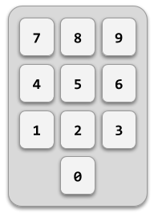

En una caja fuerte de combinación hay que introducir los números de la
combinación secreta en el orden correcto para abrirla.

**Input Format**

La entrada consiste en primer lugar en tres números que indican la
combinación secreta.

A continuación viene la secuencia de números introducidos (como mínimo
3). La secuencia termina con -1.

**Constraints**

\-

**Output Format**

Se imprimirá "ABIERTA" si se ha introducido en algún momento la
combinación secreta o "CERRADA" en caso contrario.

**Sample Input 0**

    13 42 25
    66 13 42 25 77    -1

**Sample Output 0**

    ABIERTA

**Sample Input 1**

    7 11 17
    9 3 7 11 17   -1

**Sample Output 1**

    ABIERTA

**Sample Input 2**

    7 11 17
    9 3 7 11 15 17   -1

**Sample Output 2**

    CERRADA

**Sample Input 3**

    1 1 1
    1 1 2 1 1 2    -1

**Sample Output 3**

    CERRADA
