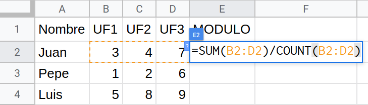

**Input Format**

La entrada és la matriu de notes

**Constraints**

\-

**Output Format**

S'imprimirà la matriu de notes, afegint la columna de la mitjana.

**Sample Input 0**

    3 4
    4 6 5 5
    8 8 6 6
    4 5 6 5

**Sample Output 0**

    4 6 5 5 5.0
    8 8 6 6 7.0
    4 5 6 5 5.0

**Sample Input 1**

    4 3
    4 6 5
    8 8 6
    4 5 6
    9 6 5

**Sample Output 1**

    4 6 5 5.0
    8 8 6 7.3333335
    4 5 6 5.0
    9 6 5 6.6666665

**Sample Input 2**

    2 6
    4 6 5 8 8 6
    4 5 6 9 6 5

**Sample Output 2**

    4 6 5 8 8 6 6.1666665
    4 5 6 9 6 5 5.8333335
