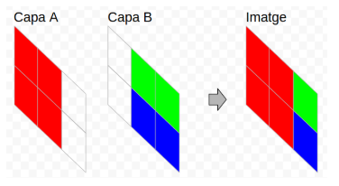
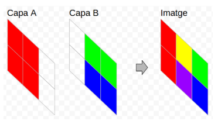

Los programas de edición de imágenes suelen tener soporte para capas. De
esta forma, una imagen se genera a partir de la composición de sus
capas. Hay varios modos de componer las capas (blending modes). Por
ejemplo están el modo **Normal** y el modo **Adición**.

Modo Normal: En el modo Normal las capas superiores cubren a las capas
inferiores. Es decir, cada píxel de una capa superior cubre a los
píxeles de las capas inferiores que están en la misma posición, excepto
si dicho píxel es transparente.

Modo Adición: En el modo Adición, los píxeles de cada capa que están en
la misma posición se suman para obtener el color del píxel resultante.

El color de un píxel se expresa con un número. **Los píxeles
transparentes se representan con un 0**.

**Input Format**

Los dos primeros números indican el tamaño de la imagen:  y ,
respectivamente.

A continuación viene el color de cada píxel de la capa  y después de la
capa .

Por último, se expresa el  que hay que aplicar para generar la imagen:
ADD o NORMAL.

**Constraints**

\-

**Output Format**

Se imprimirá la imagen resultante tras aplicar el blending mode indicado
a las dos capas.

**Sample Input 0**

    3 3
    
    0 0 0
    1 1 1
    0 0 0
    
    0 1 0
    0 1 0
    0 1 0
    
    ADD

**Sample Output 0**

    0 1 0
    1 2 1
    0 1 0

**Sample Input 1**

    3 3
    
    0 0 0
    1 1 1
    0 0 0
    
    0 1 0
    0 1 0
    0 1 0
    
    NORMAL

**Sample Output 1**

    0 1 0
    1 1 1
    0 1 0

**Sample Input 2**

    2 3
    
    5 5 0
    5 5 0
    
    0 1 1
    0 2 2
    
    ADD

**Sample Output 2**

    5 6 1
    5 7 2

**Sample Input 3**

    2 3
    
    5 5 0
    5 5 0
    
    0 1 1
    0 2 2
    
    NORMAL

**Sample Output 3**

    5 5 1
    5 5 2

**Sample Input 4**

    5 5
    
    1 2 0 0 0
    0 1 1 2 2
    0 0 0 1 1
    0 1 1 0 0
    3 2 3 3 3
    
    0 0 0 1 1
    0 0 0 1 1
    1 1 1 1 1
    2 2 2 2 2
    2 2 2 2 2
    
    ADD

**Sample Output 4**

    1 2 0 1 1 
    0 1 1 3 3 
    1 1 1 2 2 
    2 3 3 2 2 
    5 4 5 5 5

**Sample Input 5**

    5 5
    
    1 2 0 0 0
    0 1 1 2 2
    0 0 0 1 1
    0 1 1 0 0
    3 2 3 3 3
    
    0 0 0 1 1
    0 0 0 1 1
    1 1 1 1 1
    2 2 2 2 2
    2 2 2 2 2
    
    NORMAL

**Sample Output 5**

    1 2 0 1 1 
    0 1 1 2 2 
    1 1 1 1 1 
    2 1 1 2 2 
    3 2 3 3 3
