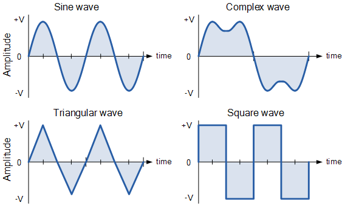

 Per a comprovar el
funcionament d'un generador de corrent elèctrica alterna, es mesura
periòdicament el voltatge de la corrent generada.

Es considera que el generador funciona correctament si el voltatge
alterna pujades i baixades. És a dir, si en una medició el voltatge ha
pujat, en la següent ha d'haver baixat, i viceversa.

La primera medició respecte de la segona ha de ser de pujada.

**Input Format**

La entrada consisteix en una seqüència de números que representen els
voltages mesurats.

La seqüència acaba amb un 0, que no s'ha de computar.

**Constraints**

\-

**Output Format**

S'imprimirà "CORRECTE" si la seqüència de números ha anat alternant
pujades i baixades, i "INCORRECTE" en cas contrari.

**Sample Input 0**

    1 5 2 7 3   0

**Sample Output 0**

    CORRECTE

**Sample Input 1**

    2 5 3 6 7   0

**Sample Output 1**

    INCORRECTE

**Sample Input 2**

    3 1 3 1 3    0

**Sample Output 2**

    INCORRECTE

**Explanation 2**

La primera i la segona medició no són de pujada

**Sample Input 3**

    4 4 3 6 3   0

**Sample Output 3**

    INCORRECTE

----------

** Autoria: **
[Gerard Falcó](https://github.com/gerardfp)
