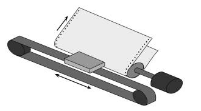

La impresora matricial consta de un cabezal de impresión que se desplaza
de izquierda a derecha imprimiendo sobre la página por impacto,
oprimiendo una cinta de tinta contra el papel (similar a una máquina de
escribir).

Una orden de impresión se representa con una serie de números:

  - Un número X mayor o igual a cero significa desplazar el cabezal X
    posiciones e imprimir una \#
  - Un -1 indica avanzar una línea el papel y volver el cabezal al
    principio
  - Un -2 significa que ha finalizado la impresión.

**Input Format**

Una serie de números indicando las instrucciones de impresión. Termina
con un -2 que indica el fin de la impresión.

**Constraints**

\-

**Output Format**

Se imprimirá el resultado de la impresión. Cada desplazamiento del
cabezal será un espacio en blanco, y cada punto de impresión una
almohadilla.

**Sample Input 0**

    3 2 1 0 -2

**Sample Output 0**

``` 
   #  # ##
```

**Explanation 0**

Se imprimen 3 espacios y una almohadilla Se imprimen 2 espacios y una
almohadilla Se imprimen 1 espacios y una almohadilla Se imprimen 0
espacios y una almohadilla

**Sample Input 1**

    0 0 0 -1 0 1 -1 1 -2

**Sample Output 1**

    ###
    # #
     #

**Explanation 1**

Se imprimen 0 espacios y una almohadilla Se imprimen 0 espacios y una
almohadilla Se imprimen 0 espacios y una almohadilla Se imprime un salto
de línea (-1) Se imprimen 0 espacios y una almohadilla Se imprimen 1
espacios y una almohadilla Se imprime un salto de línea (-1) Se imprimen
1 espacios y una almohadilla

**Sample Input 2**

    2 -1
    1 1 -1
    0 0 0 0 0 -1
    2
    -2

**Sample Output 2**

``` 
  #
 # #
#####
  #
```

**Sample Input 3**

    3 2 -1 
    2 0 0 0 0 0 -1 
    1 0 0 0 0 0 0 0 -1 
    0 0 0 1 0 1 0 0 -1
    0 1 0 0 0 0 0 1 -1
    0 2 2 2 -1
    2 0 2 0 
    -2

**Sample Output 3**

``` 
   #  #
  ######
 ########
### ## ###
# ###### #
#  #  #  #
  ##  ##
```

**Sample Input 4**

    5 0 0 0 0 -1 3 0 5 0 -1 2 9 -1 1 11 -1 1 11 -1 0 0 0 0 0 0 0 0 0 0 0 0 0 0 0 -1 0 1 0 2 0 0 0 2 1 -1 0 1 0 0 1 1 0 0 1 1 -1 0 2 0 0 3 0 0 2 -1 0 13 -1 1 2 8 -1 1 3 0 0 0 0 3 -1 2 9 -1 3 0 5 0 -1 5 0 0 0 0 -1 -2

**Sample Output 4**

``` 
     #####
   ##     ##
  #         #
 #           #
 #           #
###############
# ##  ####  # #
# ### # ### # #
#  ###   ###  #
#             #
 #  #        #
 #   #####   #
  #         #
   ##     ##
     #####
```

----------

** Autoria: **
[Gerard Falcó](https://github.com/gerardfp)
