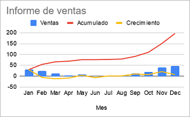

Es requereix desenvolupar una aplicació que realitzi un informe de
vendes.

A partir del volum de vendes de cada mes, l'informe ha d'incloure:

  - El creixement mensual: consisteix en restar a les vendes de cada mes
    les vendes del mes anterior.

  - Les vendes acumulades: es tracta de sumar a les vendes de cada mes
    les vendes de tots els mesos anteriors.

**Input Format**

El primer número  indica la quantitat de mesos.

A continuació, el volum de vendes de cada mes.

**Constraints**

\-

**Output Format**

S'imprimiràn, en format Array, el creixement i les vendes acumulades,
cadascun en una línia.

*Es permet utilitzar el mètode `Arrays.toString()` per a imprimir els
resultats*

**Sample Input 0**

    5
    10 20 50 70 120

**Sample Output 0**

    [10, 10, 30, 20, 50]
    [10, 30, 80, 150, 270]

**Explanation 0**

\[10, 20-10, 50-20, 70-50, 120-70\]

\[10, 20+10, 50+20+10, 70+50+20+10, 120+70+50+20+10\]

**Sample Input 1**

    3
    100 150 250

**Sample Output 1**

    [100, 50, 100]
    [100, 250, 500]

**Explanation 1**

\[100, 150-100, 250-150\]

\[100, 150+100, 250+150+100\]

**Sample Input 2**

    4
    1 3 6 10

**Sample Output 2**

    [1, 2, 3, 4]
    [1, 4, 10, 20]

**Explanation 2**

\[1, 3-1, 6-3, 10-6\]

\[1, 3+1, 6+3+1, 10+6+3+1\]

**Sample Input 3**

    1
    1000

**Sample Output 3**

    [1000]
    [1000]

**Sample Input 4**

    2
    1000 1000

**Sample Output 4**

    [1000, 0]
    [1000, 2000]

**Sample Input 5**

    10
    5 4 3 6 4 8 7 4 1 2

**Sample Output 5**

    [5, -1, -1, 3, -2, 4, -1, -3, -3, 1]
    [5, 9, 12, 18, 22, 30, 37, 41, 42, 44]

----------

** Autoria: **
[Gerard Falcó](https://github.com/gerardfp)
