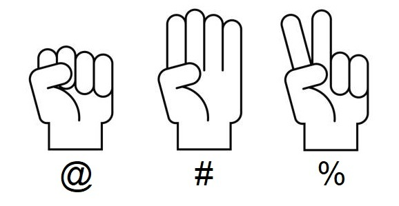

Donades un sèrie de rondes del joc Pedra-Paper-Tisora, determina el
guanyador de la partida.

**Input Format**

Cada ronda de la partida s'indica en una línia diferent.

En cada ronda el primer caracter indica la ma treta pel jugador 1, i el
segon caracter la ma treta pel jugador 2.

  - El caracter @ significa "Pedra"
  - El caracter \# significa "Paper"
  - El caracter % significa "Tisora"

El final de la partida es marca amb "END".

**Constraints**

\-

**Output Format**

S'imprimirà '1' si guanya el jugador 1, i '2' si ho fa el jugador 2. Si
hi ha empat s'imprimirà '-'.

**Sample Input 0**

    @%
    #@
    %#
    END

**Sample Output 0**

``` 
1
```

**Explanation 0**

La primera ronda el JUGADOR1 trau PEDRA (@) i el JUGADOR2 trau TISORA
(%) =\> 1 punt per a JUGADOR1.

En la segona ronda el JUGADOR1 trau PAPER (\#) i el JUGADOR2 trau PEDRA
(@) =\> 1 punt per a JUGADOR1.

En la tercera ronda el JUGADOR1 trau TISORA (%) i el JUGADOR2 trau PAPER
(\#) =\> 1 punt per a JUGADOR1.

El resultat final és JUGADOR1 = 3 punts i JUGADOR2 = 0 punts. Guanya
JUGADOR1

**Sample Input 1**

    @#
    @%
    @@
    @%
    END

**Sample Output 1**

``` 
1
```

**Sample Input 2**

    #@
    #%
    #%
    ##
    END

**Sample Output 2**

``` 
2
```

**Sample Input 3**

    %#
    %%
    #%
    %#
    END

**Sample Output 3**

``` 
1
```

**Sample Input 4**

    @%
    @%
    @%
    @%
    @%
    END

**Sample Output 4**

``` 
1
```

**Sample Input 5**

    #%
    @#
    %@
    END

**Sample Output 5**

``` 
2
```

**Sample Input 6**

    @@
    END

**Sample Output 6**

``` 
-
```

**Sample Input 7**

    @@
    ##
    %%
    END

**Sample Output 7**

``` 
-
```

**Sample Input 8**

    @#
    #@
    @%
    %@
    END

**Sample Output 8**

``` 
-
```

**Sample Input 9**

    @%
    @#
    @@
    %@
    #@
    @@
    END

**Sample Output 9**

``` 
-
```

**Sample Input 10**

    #@
    #%
    @#
    %#
    %#
    %@
    #%
    @@
    @#
    %#
    #%
    %%
    ##
    %@
    END

**Sample Output 10**

``` 
2
```

----------

** Autoria: **
[Gerard Falcó](https://github.com/gerardfp)
