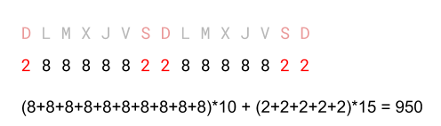
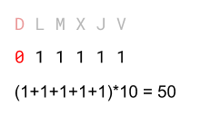
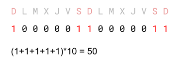
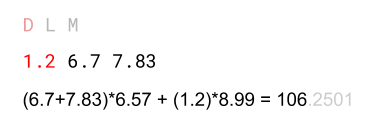

Per a calcular el salari d'un treballador es mira la quantitat d'hores
treballades i a quan es paga l'hora.

Les hores treballades en dissabte i diumenge són "extra" i es paguen a
un preu diferent.

A partir del registre d'hores treballades cada dia per un treballador i
el preus per hora i per hora extra, calcula el seu salari.

**Input Format**

El primer número  indica la quantitat de dies enregistrats.

A continuació ve una sèrie de  números decimals que indiquen la
quantitat d'hores treballades cada dia. **El primer dia correspon a
Diumenge**.

A continuació venen el preu per hora, i el preu per hora extra.

**Constraints**

\-

**Output Format**

S'imprimirà el salari total, sense decimals.

**Sample Input 0**

    15
    2 8 8 8 8 8 2 2 8 8 8 8 8 2 2
    10
    15

**Sample Output 0**

    950

**Explanation 0**



**Sample Input 1**

    6
    0 1 1 1 1 1
    10
    15

**Sample Output 1**

``` 
50
```

**Explanation 1**



**Sample Input 2**

    15
    1 0 0 0 0 0 1 1 0 0 0 0 0 1 1
    5
    10

**Sample Output 2**

``` 
50
```

**Explanation 2**



**Sample Input 3**

    3
    1.2 6.7 7.83
    6.57
    8.99

**Sample Output 3**

    106

**Explanation 3**



**Sample Input 4**

    30
    2 6 5 3 7 6 5 4 6 7 5 6 7 4 5 8 9 4 5 4 3 5 5 4 7 6 8 5 4 7
    7.27
    9.87

**Sample Output 4**

    1273

**Sample Input 5**

    64
    7 5 5 4 6 7 7 4 5 4 4 5 6 7 4 4 5 5 4 4 5 4 5 4 4 7 7 6 6 7 5 4 5 4 6 4 7 7 6 4 7 6 7 7 7 6 5 6 4 6 6 6 6 4 6 5 7 4 4 6 4 5 7 7 
    9.99
    14.99

**Sample Output 5**

    4011

**Sample Input 6**

    1
    5
    10
    20

**Sample Output 6**

    100

**Sample Input 7**

    256
    7 2 8 8 5 3 4 8 6 3 5 6 1 8 1 5 1 0 4 0 6 8 2 0 2 5 2 5 3 2 4 8 4 8 2 0 6 0 3 1 7 0 7 8 4 2 3 7 6 4 7 8 8 2 1 4 5 0 2 0 3 0 1 3 5 3 6 0 0 5 6 1 0 6 6 4 6 7 5 2 1 7 1 7 5 4 2 5 6 6 1 4 4 6 0 0 4 1 5 1 3 6 1 7 0 5 0 8 6 2 7 2 7 6 2 4 2 6 1 4 6 5 3 2 6 0 4 7 0 0 3 0 7 1 2 0 2 5 8 7 0 8 3 0 8 2 6 8 3 5 2 7 8 6 5 1 0 6 5 4 3 5 5 3 6 1 2 4 2 6 7 8 7 3 7 5 7 4 8 5 0 6 1 7 8 5 5 2 8 4 5 6 2 6 3 4 0 1 6 5 4 6 3 8 0 6 3 5 4 0 0 2 8 6 3 6 5 4 5 3 7 1 7 1 8 6 3 6 2 0 8 2 2 0 6 0 8 3 1 7 7 2 7 4 3 8 4 3 6 4 0 5 5 6 7 0 
    12.49
    17.69

**Sample Output 7**

    14400

----------

** Autoria: **
[Gerard Falcó](https://github.com/gerardfp)
