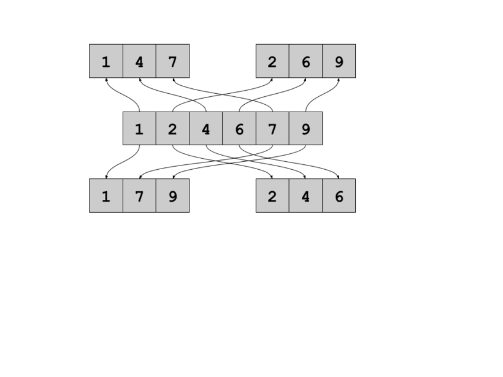
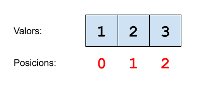

Donada una seqüència de números, s'ha de separar en base a dos criteris:

Segons la **posició**:

Se separarà la seqüència original en dues seqüències:

  - En una els que ocupen una posició parell,
  - En l'altra els que ocupen una posició imparell.

Segons el **valor**:

Se separarà la seqüència original en dues seqüències:

  - En una els números parells,
  - En l'altra els imparells.

**Input Format**

El primer nombre  indica el tamany de la seqüència. A continuació ve la
seqüència.

**Constraints**

\-

**Output Format**

S'imprimirán 4 seqüències, entre les dues primeres i les dues últimes
s'imprimirà un salt de línia extra.

Les dues primeres seqüències són la separació per posició (posició
parell/imparell).

Les dues últimes són la separació per valor (valor parell/imparell).

**Sample Input 0**

    3    
    1 2 3

**Sample Output 0**

    1 3
    2
    
    2
    1 3

**Explanation 0**

Posició parell: 1, 3

Posició imparell: 2

Valor parell: 2

Valor imparell: 1, 3

**Sample Input 1**

    5    
    5 4 8 6 7

**Sample Output 1**

    5 8 7
    4 6
    
    4 8 6
    5 7

**Sample Input 2**

    2   
    6 3

**Sample Output 2**

    6
    3
    
    6
    3

**Sample Input 3**

    10    
    3 6 34 6 2 4 6 23 45 4

**Sample Output 3**

    3 34 2 6 45
    6 6 4 23 4
    
    6 34 6 2 4 6 4
    3 23 45

**Sample Input 4**

    5   
    2 3 4 5 6

**Sample Output 4**

    2 4 6
    3 5
    
    2 4 6
    3 5

**Sample Input 5**

    20
    3 5 4 2 6 7 8 0 1 5 3 4 5 6 3 7 8 1 0 4

**Sample Output 5**

    3 4 6 8 1 3 5 3 8 0 
    5 2 7 0 5 4 6 7 1 4 
    
    4 2 6 8 0 4 6 8 0 4 
    3 5 7 1 5 3 5 3 7 1
