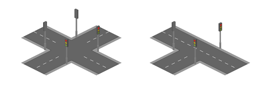
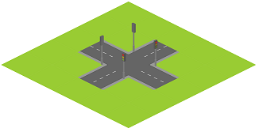
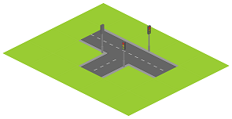
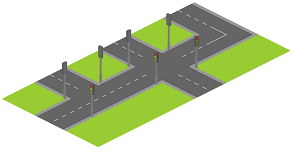

Los **Tilemaps** son una técnica popular en el desarrollo de juegos 2D,
que consiste en construir el mundo del juego a partir de pequeñas
imagenes regulares llamadas *tiles*.

Estamos desarrollando un juego de simulación de ciudades isométrico. Ya
tenemos listo el desarrollo de las carreteras. El mapa del juego está
representado internamente por una matriz de caracteres. Cada caracter
corresponde a un *tile* del mapa. Los tiles donde hay carretera
corresponden al caracter `#`, y en los que hay hierba, el caracter `.`

Por ejemplo el siguiente mapa se representa con la siguiente matriz:


Para hacer más atractivo el juego queremos añadir los semáforos en las
intersecciones. Emepezaremos contando el número de semáforos que serán
necesarios.

Necesitaremos 3 semáforos en aquellas intersecciones donde se crucen 3
carreteras, y 4 en los cruces de 4 carreteras:



**Input Format**

En primer lugar, los números  y  indican el ancho y alto del mapa,
respectivamente.

A continuación vienen los x *tiles* del mapa (`#` `.`). Los *tiles*
están separados por espacios en blanco y saltos de línea.

**Constraints**

\-

**Output Format**

Un entero indicando la cantidad de semáforos necesaria

**Sample Input 0**

    5 5
    . . . . .
    . . # . .
    . # # # .
    . . # . .
    . . . . .

**Sample Output 0**

``` 
4
```

**Explanation 0**



**Sample Input 1**

    4 5
    . . . .
    . . # .
    . # # .
    . . # .
    . . . .

**Sample Output 1**

``` 
3
```

**Explanation 1**



**Sample Input 2**

    7 4
    . . . . . . .
    . # # # . # .
    . # . # # # .
    . . . . . . .

**Sample Output 2**

``` 
0
```

**Explanation 2**


**Sample Input 3**

    6 3
    . # . # . #
    # # # # # #
    . . . # . .

**Sample Output 3**

``` 
7
```

**Explanation 3**



**Sample Input 4**

    7 4
    . . # . . . .
    # # # # # # #
    . . . # . # .
    . . . # . # .

**Sample Output 4**

``` 
9
```

**Sample Input 5**

    8 5
    . # . # . . # .
    # # # # . . # #
    . # . # . . # .
    . # # # # # # .
    . . # . . # . .

**Sample Output 5**

``` 
19
```

**Sample Input 6**

    11 8
    # . . # . . . # . . #
    # . . # # # # # . . #
    # # . # . . . # # # #
    . # # # . . # # . . #
    . . . # . . # . . . #
    . # # # # # # # # # #
    # # . # . . # . . # .
    # . . # # # # # # # .

**Sample Output 6**

``` 
29
```

**Sample Input 7**

    4 4
    . . # .
    . . # .
    # # # #
    # . # .

**Sample Output 7**

``` 
4
```

----------

** Autoria: **
[Gerard Falcó](https://github.com/gerardfp)
