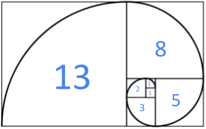

La successió de Fibonacci comença amb els nombres 0 i 1, i a partir
d'aquests, «cada terme és la suma dels dos anteriors».

A partir de vàries sequències de nombres, determina si són successions
de Fibonacci.

**Input Format**

El primer nombre  indica la quantitat de seqüències que venen després.

Cada sequència de N nombres acaba amb un -1.

**Constraints**

Cada seqüència té almenys 2 números.

**Output Format**

Un "SI" o un "NO" per cada seqüència; separats per un salt de línia.

**Sample Input 0**

    2
    1 1 2 3    -1
    0 1 1    -1

**Sample Output 0**

    NO
    SI

**Sample Input 1**

    2
    0 1 1 2 3 5    -1
    0 1 1 5    -1

**Sample Output 1**

    SI
    NO

**Sample Input 2**

    2
    1 1 2 3 5    -1
    0 1    -1

**Sample Output 2**

    NO
    SI

**Sample Input 3**

    4
    0 0 1 1 2 3 5    -1
    0 1 2 3 5 8    -1
    0 1 1 2 3 5 13    -1
    0 1 1 2 3 5 8 13 21 34 55    -1

**Sample Output 3**

    NO
    NO
    NO
    SI

----------

** Autoria: **
[Gerard Falcó](https://github.com/gerardfp)
