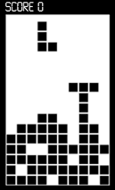
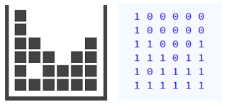

Al Tetris, quan una línia horitzontal es completa, aquesta línia
desapareix i totes les peces que estan a sobre descendeixen una posició.

Donat un tauler de Tetris, imprimeix el tauler resultant d'eliminar les
línies completades.

**Input Format**

Primer s'indica el número de  i  del tauler.

A continuació venen una sèrie de `1` i `0` que indiquen l'estat de cada
casella. `1` significa ocupada i `0` significa lliure.

Per exemple, aquest tauler de Tetris es podria representar així:

**Constraints**

\-

**Output Format**

S'imprimirà el tauler resultant amb el mateix format que a l'entrada.

**Sample Input 0**

    3 4
    1 1 0 1
    1 0 0 1
    1 1 1 1

**Sample Output 0**

    1 1 0 1
    1 0 0 1

**Sample Input 1**

    5 4
    1 0 0 1
    1 1 1 1
    1 0 1 1
    1 1 0 0
    0 1 1 1

**Sample Output 1**

    1 0 0 1
    1 0 1 1
    1 1 0 0
    0 1 1 1

**Sample Input 2**

    6 4
    1 0 0 0
    1 1 0 0
    1 1 1 1
    1 1 1 1
    0 1 1 1
    1 1 1 1

**Sample Output 2**

    1 0 0 0
    1 1 0 0
    0 1 1 1

**Sample Input 3**

    8 5
    0 0 0 0 0
    0 0 0 0 0
    1 0 0 0 1
    1 1 0 0 1
    1 1 1 1 1
    1 1 1 1 1
    0 1 1 1 1
    1 1 1 1 0

**Sample Output 3**

    0 0 0 0 0
    0 0 0 0 0
    1 0 0 0 1
    1 1 0 0 1
    0 1 1 1 1
    1 1 1 1 0

**Sample Input 4**

    3 4
    1 1 1 1
    1 1 1 1
    1 1 1 1
