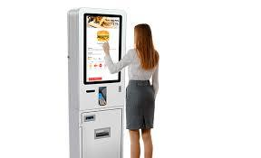

Estamos desarrollando una aplicación para un Terminal de Punto de Venta
de un restaurante de comida rápida.

El cliente va seleccionando los productos que desea pedir y el terminal
le muestra el precio total del pedido.

**Input Format**

En primer lugar se indican los datos de la carta de productos:

  - El primer número
    indica la cantidad de productos disponibles en la carta.
  - A continuación vienen los
    nombres de cada producto (una palabra)
  - A continuación vienen los
    precios de cada producto (float)

Luego vienen los datos del pedido:

  - El primer número
    indica la cantidad de líneas que hay en el pedido
  - Por cada línea se indica, el nombre del producto y la cantidad de
    unidades pedidas

En el pedido puede haber productos repetidos en distintas líneas.

**Constraints**

\-

**Output Format**

Se imprimirá el precio total del pedido en formato float.

**Sample Input 0**

    5
    Hamburguesa Refresco Patatas Ensalada Tarta
    4           1        2       3        5
    
    3
    Hamburguesa 2
    Refresco 2
    Tarta 1

**Sample Output 0**

    15.0

**Explanation 0**

2\*4 + 2\*1 + 1\*5 = 15

**Sample Input 1**

    3
    Pizza Frankfurt Sandwich
    4     2.5       1.25   
    
    2
    Pizza 3
    Frankfurt 2

**Sample Output 1**

    17.0

**Explanation 1**

3\*4 + 2.5\*2 = 17

**Sample Input 2**

    6
    Pizza Burguer Hotdog Chips Kebab Burrito
    4.25  3.75    2.25   0.75  3.5   3.5
    
    4
    Pizza 2
    Burguer 2
    Hotdog 3
    Burrito 1

**Sample Output 2**

    26.25

**Sample Input 3**

    3
    Hamburguesa Patatas Bebida
    3           2       1
    
    5
    Hamburguesa 2
    Patatas 1
    Hamburguesa 1
    Bebida 2
    Patatas 2

**Sample Output 3**

    17.0
