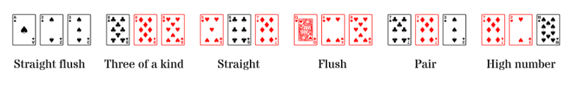

Al Three Card Poker es poden fer les següents figures:

  - **Straight flush**: 3 cartes amb números consecutius del mateix pal
  - **Three of a kind**: 3 cartes del mateix número
  - **Straight**: 3 cartes amb números consecutius
  - **Flush**: 3 cartes del mateix pal
  - **Pair**: 2 cartes del mateix número
  - **High number**: cap de les anteriors

En la nostra versió del joc, jugarem només amb els números, no amb els
pals. Així, les figures possibles seran:

  - **Three of a kind**
  - **Straight**
  - **Pair**
  - **High number**

**Input Format**

L'entrada consta de 3 números enters corresponents als números de les
cartes.

**Constraints**

No hi ha

**Output Format**

S'imprimirà la figura de més valor.

{     |  |  |   }

**Sample Input 0**

    1 1 1

**Sample Output 0**

    THREE OF A KIND

**Sample Input 1**

    1 1 2

**Sample Output 1**

    PAIR

**Sample Input 2**

    1 1 3

**Sample Output 2**

    PAIR

**Sample Input 3**

    1 1 4

**Sample Output 3**

    PAIR

**Sample Input 4**

    1 2 1

**Sample Output 4**

    PAIR

**Sample Input 5**

    1 2 2

**Sample Output 5**

    PAIR

**Sample Input 6**

    1 2 3

**Sample Output 6**

    STRAIGHT

**Sample Input 7**

    1 2 4

**Sample Output 7**

    HIGH CARD

**Sample Input 8**

    1 3 1

**Sample Output 8**

    PAIR

**Sample Input 9**

    1 3 2

**Sample Output 9**

    STRAIGHT

**Sample Input 10**

    1 3 3

**Sample Output 10**

    PAIR

**Sample Input 11**

    1 3 4

**Sample Output 11**

    HIGH CARD

**Sample Input 12**

    1 4 1

**Sample Output 12**

    PAIR

**Sample Input 13**

    1 4 2

**Sample Output 13**

    HIGH CARD

**Sample Input 14**

    1 4 3

**Sample Output 14**

    HIGH CARD

**Sample Input 15**

    1 4 4

**Sample Output 15**

    PAIR

**Sample Input 16**

    2 1 1

**Sample Output 16**

    PAIR

**Sample Input 17**

    2 1 2

**Sample Output 17**

    PAIR

**Sample Input 18**

    2 1 3

**Sample Output 18**

    STRAIGHT

**Sample Input 19**

    2 1 4

**Sample Output 19**

    HIGH CARD

**Sample Input 20**

    2 2 1

**Sample Output 20**

    PAIR

**Sample Input 21**

    2 2 2

**Sample Output 21**

    THREE OF A KIND

**Sample Input 22**

    2 2 3

**Sample Output 22**

    PAIR

**Sample Input 23**

    2 2 4

**Sample Output 23**

    PAIR

**Sample Input 24**

    2 3 1

**Sample Output 24**

    STRAIGHT

**Sample Input 25**

    2 3 2

**Sample Output 25**

    PAIR

**Sample Input 26**

    2 3 3

**Sample Output 26**

    PAIR

**Sample Input 27**

    2 3 4

**Sample Output 27**

    STRAIGHT

**Sample Input 28**

    2 4 1

**Sample Output 28**

    HIGH CARD

**Sample Input 29**

    2 4 2

**Sample Output 29**

    PAIR

**Sample Input 30**

    2 4 3

**Sample Output 30**

    STRAIGHT

**Sample Input 31**

    2 4 4

**Sample Output 31**

    PAIR

**Sample Input 32**

    3 1 1

**Sample Output 32**

    PAIR

**Sample Input 33**

    3 1 2

**Sample Output 33**

    STRAIGHT

**Sample Input 34**

    3 1 3

**Sample Output 34**

    PAIR

**Sample Input 35**

    3 1 4

**Sample Output 35**

    HIGH CARD

**Sample Input 36**

    3 2 1

**Sample Output 36**

    STRAIGHT

**Sample Input 37**

    3 2 2

**Sample Output 37**

    PAIR

**Sample Input 38**

    3 2 3

**Sample Output 38**

    PAIR

**Sample Input 39**

    3 2 4

**Sample Output 39**

    STRAIGHT

**Sample Input 40**

    3 3 1

**Sample Output 40**

    PAIR

**Sample Input 41**

    3 3 2

**Sample Output 41**

    PAIR

**Sample Input 42**

    3 3 3

**Sample Output 42**

    THREE OF A KIND

**Sample Input 43**

    3 3 4

**Sample Output 43**

    PAIR

**Sample Input 44**

    3 4 1

**Sample Output 44**

    HIGH CARD

**Sample Input 45**

    3 4 2

**Sample Output 45**

    STRAIGHT

**Sample Input 46**

    3 4 3

**Sample Output 46**

    PAIR

**Sample Input 47**

    3 4 4

**Sample Output 47**

    PAIR

**Sample Input 48**

    4 1 1

**Sample Output 48**

    PAIR

**Sample Input 49**

    4 1 2

**Sample Output 49**

    HIGH CARD

**Sample Input 50**

    4 1 3

**Sample Output 50**

    HIGH CARD

**Sample Input 51**

    4 1 4

**Sample Output 51**

    PAIR

**Sample Input 52**

    4 2 1

**Sample Output 52**

    HIGH CARD

**Sample Input 53**

    4 2 2

**Sample Output 53**

    PAIR

**Sample Input 54**

    4 2 3

**Sample Output 54**

    STRAIGHT

**Sample Input 55**

    4 2 4

**Sample Output 55**

    PAIR

**Sample Input 56**

    4 3 1

**Sample Output 56**

    HIGH CARD

**Sample Input 57**

    4 3 2

**Sample Output 57**

    STRAIGHT

**Sample Input 58**

    4 3 3

**Sample Output 58**

    PAIR

**Sample Input 59**

    4 3 4

**Sample Output 59**

    PAIR

**Sample Input 60**

    4 4 1

**Sample Output 60**

    PAIR

**Sample Input 61**

    4 4 2

**Sample Output 61**

    PAIR

**Sample Input 62**

    4 4 3

**Sample Output 62**

    PAIR

**Sample Input 63**

    4 4 4

**Sample Output 63**

    THREE OF A KIND
