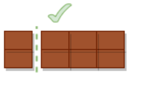
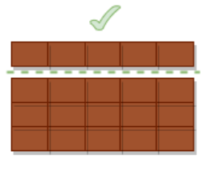
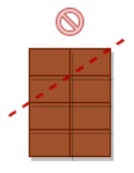

Una barra de xocolata té x quadradets. Esbrina si és possible paritr la
barra per una única línia, de forma que ens quedi un troç amb exactament
 quadradets.

**Input Format**

Tres nombres enters:  - Açada  - Amplada  - Quadradets a obtenir

**Constraints**

\-

**Output Format**

`SI` | `NO`

**Sample Input 0**

    4 2 6

**Sample Output 0**

``` 
SI
```

**Explanation 0**



**Sample Input 1**

    5 4 5

**Sample Output 1**

``` 
SI
```

**Explanation 1**



**Sample Input 2**

    2 4 3

**Sample Output 2**

``` 
NO
```

**Explanation 2**



**Sample Input 3**

    2 6 18 

**Sample Output 3**

``` 
NO
```

**Explanation 3**

No hi ha prou quadradets a la barreta

**Sample Input 4**

    6 7 18

**Sample Output 4**

``` 
SI
```

**Sample Input 5**

    5 6 12

**Sample Output 5**

``` 
SI
```

**Sample Input 6**

    5 6 12

**Sample Output 6**

``` 
SI
```

**Sample Input 7**

    4 6 10

**Sample Output 7**

``` 
NO
```
